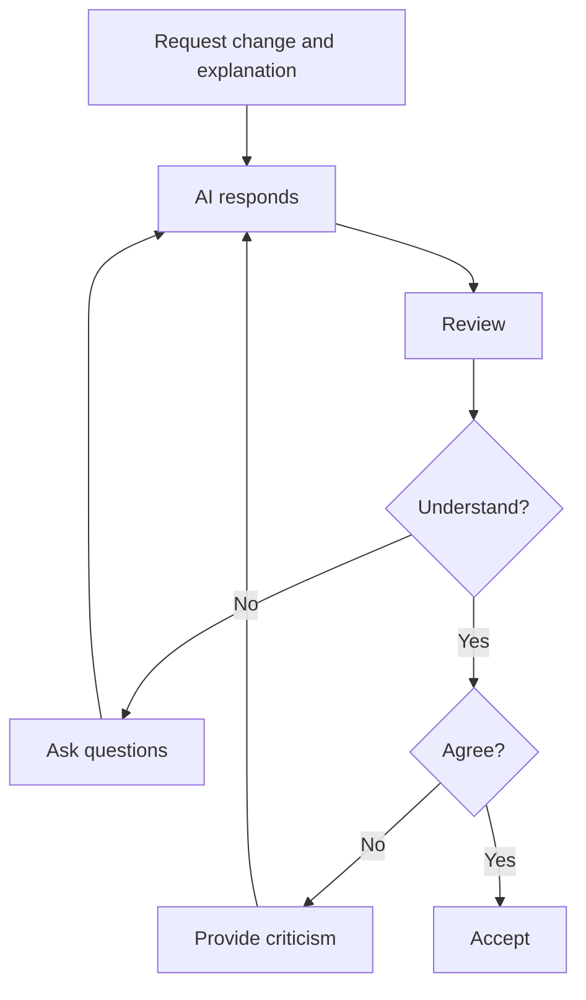
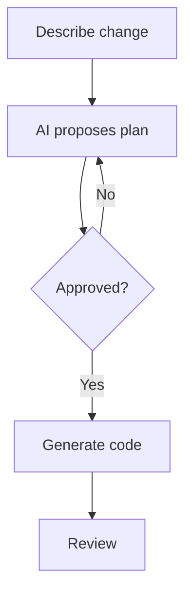
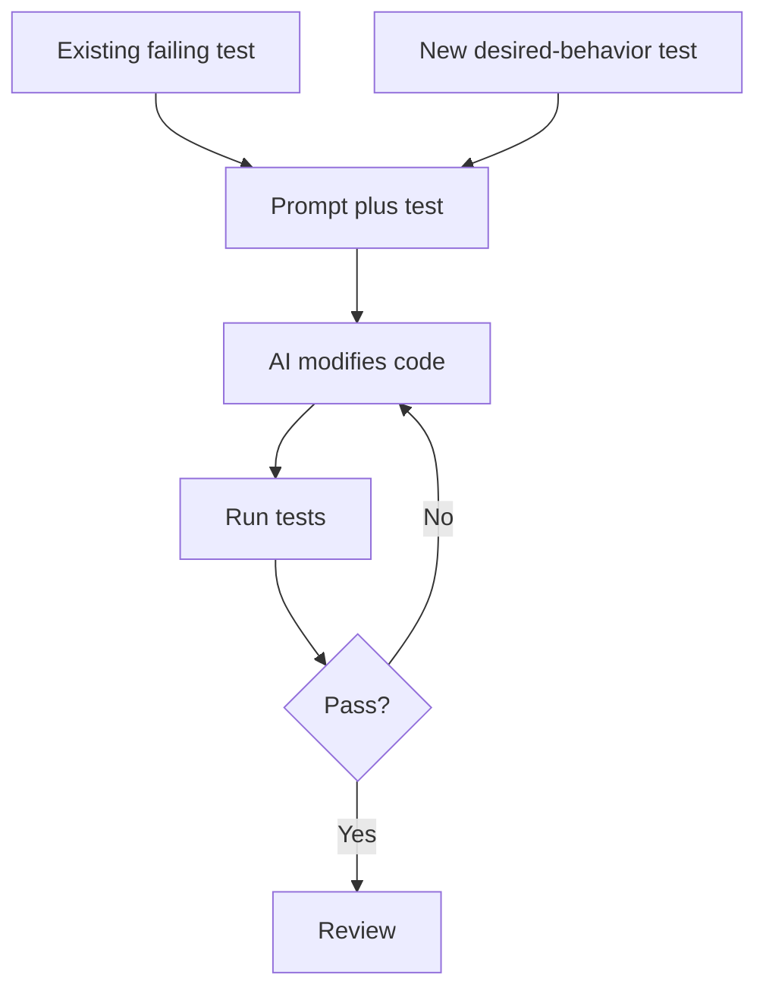
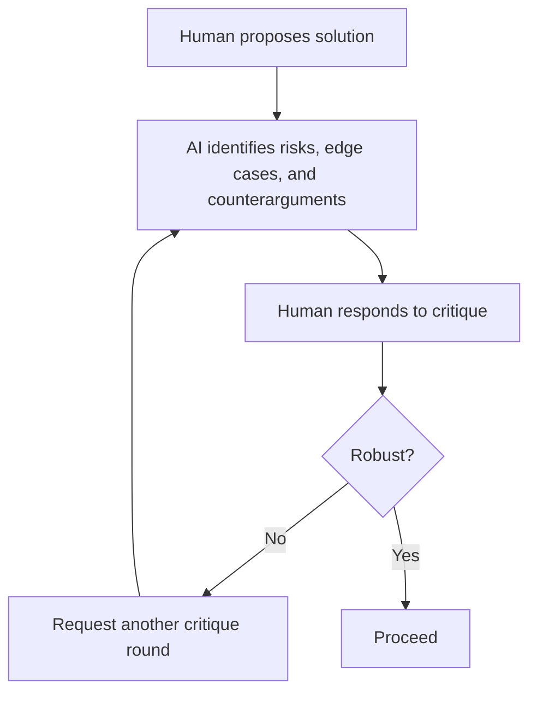
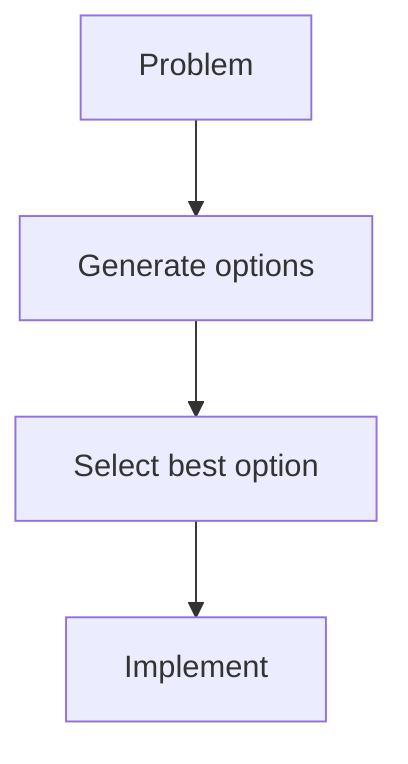
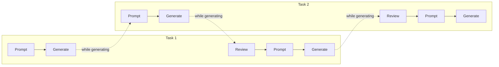

import Callout from '@components/Callout.astro';

Agentic coding is now ubiquitous across much of the technology industry. However, there is still substantial debate about how best to integrate human workflows with AI systems. This note explores practical patterns, tradeoffs, and workflow archetypes for using AI effectively during software development.

# AI Task Ability

While AI performs strongly across many coding benchmarks, its performance is highly task-dependent. You should be selective in your use of AI and prioritize tasks it shines at.

This heterogeneity in performance is well observed. For instance, **_Comparing AI Coding Agents: A Task-Stratified Analysis of Pull Request Acceptance_** (Pinna et al., 2026), analyzed **7,156 AI-generated pull requests** across **five coding agents**: Codex, Copilot, Devin, Cursor, and Claude Code and found significant discrepancy in average acceptance rates by task type:

| Task Type | Acceptance Rate |
|------------|----------------|
| Documentation | 82.1% |
| Refactor | 71.2% |
| Feature Development | 66.1% |
| Bug Fixing | 66.0% |
| Testing | 61.5% |
| Performance Optimization | 55.4% |

<Callout type="info" title="Info">
Studies provide useful priors, but which tasks will be performed best on depends heavily on the codebase quality, language, and your team's workflows and conventions. You should ultimately rely on your own experience and create a mental map of when to use or not to use AI for something.
</Callout>

## My Personal Ranking

### Good Fit

- Refactoring with clearly defined requirements (not "make this cleaner", "improve this code", or "simplify this").
- Small-to-medium migrations.
- Code extraction and integration into local project conventions.
- Debugging with exact traceback.
- Documentation.
- Codebase discovery and Q&A.

### Mixed Fit

- Unit testing.
- Code review.

### Poor Fit

- System design.
- Architecture.
- High-level decisions.
- Large multi-file refactors.
- Ambiguous or open-ended prompts.

# Human–AI Synergy

Several papers raise concerns about cognitive offloading when using AI-assisted coding tools.

<Callout type="note" title="Notable Studies" collapsible defaultOpen={false}>
**_How AI Assistance Impacts the Formation of Coding Skills_** (Shen & Tamkin, 2026)

- Study: randomized controlled trial with **52 mostly junior software engineers**.
- Task: learn and use the Python `trio` library.
- Result: AI-assisted participants scored **17% lower** on mastery assessments than participants coding by hand.
- Productivity improved slightly, but the speed gain was **not statistically significant**.
- Participants who used AI to build comprehension retained more than participants who mainly delegated code production.

**_Do People Engage Cognitively with AI? Impact of AI Assistance on Incidental Learning_** (Gajos & Mamykina, 2022)

- Study: controlled experiments on AI-assisted decision-making and incidental learning.
- Main result: people do not automatically learn from AI recommendations.
- In one experiment, the normalized learning gain was **0.341** when participants first made their own decision and then saw the correct AI recommendation, versus **0.167** with correctness feedback and **0.158** with simple explanations.

**_Exploring the Design Space of Cognitive Engagement Techniques with AI-Generated Code for Enhanced Learning_** (Kazemitabaar et al., 2025)

- Study 1: between-subjects study with **82 participants**.
- Study 2: within-subjects study with **42 participants**.
- Tested **7 cognitive engagement techniques** for AI-generated code.
- Best-performing technique: step-by-step problem solving, where the learner prompts each stage before code is revealed.

**_More AI Assistance Reduces Cognitive Engagement: Examining the AI Assistance Dilemma in AI-Supported Note-Taking_** (Chen et al., 2025)

- Study: within-subject experiment with **30 participants**.
- Conditions: automated AI, intermediate AI, minimal AI.
- Intermediate AI produced the highest post-test scores.
- Automated AI produced the lowest post-test scores, despite being preferred for ease of use.

**_The Impact of AI Usage and Informativeness on Skill Development in Logical Reasoning_** (Wu et al., 2026)

- Task: controlled logical reasoning with pre-AI, AI, and post-AI phases.
- Greater AI usage was associated with weaker skill development.
- Heavy AI users underperformed comparable peers.
- Light AI users performed similarly to matched non-users.
- High-information AI improved short-run performance without reducing post-AI outcomes on average.
- Low-information AI neither improved immediate performance nor preserved later performance.
</Callout>

This is still an active area of research. Experiments vary in sample size, task design, model capability, and target outcome, but the early pattern is still consistent enough to take seriously: AI often improves immediate output while reducing some forms of cognitive engagement or learning.

Some rebuttals (which may not change the final conclusion) to this exist though.

## Rebuttal 1: It Depends on Usage

In **_How AI Assistance Impacts the Formation of Coding Skills_** (Shen & Tamkin, 2026), AI-assisted participants scored **17% lower** on mastery assessments overall. But the study also found that usage pattern mattered.

Users who mainly delegated implementation retained less. Users who asked follow-up questions, requested explanations, posed conceptual questions, or used AI while still coding independently retained more (and could even exceed the no-AI control group).

<Callout type="important" title="Important">
Outsource typing speed and information retrieval.

Do not outsource reasoning.
</Callout>

## Rebuttal 2: Memory Versus Reasoning Decline

Many studies measure recall, retention, mastery, or ownership of knowledge rather than reasoning itself. That distinction matters.

Humans have repeatedly outsourced recall: first to writing, then to books, then to computers, then to the internet. AI is another step in that same direction. The core question is not whether recall declines. The question is whether retrieval becomes so expensive that it interferes with reasoning.

Memory is valuable because it gives instant access to information that can be reasoned over. If external retrieval is fast enough, shifting some recall burden to the tool can be positive. If retrieval is slow, repeated, or shallow, then the user spends too much time re-ingesting knowledge before they can think with it.

<Callout type="important" title="Important">
Preserve reasoning ability.

Preserve enough recall to retrieve and manipulate information efficiently.
</Callout>

# AI Interaction Archetypes

## Archetype 1: Hand Extension

Small-to-medium tasks where you already know exactly what should happen.

AI is not planning. AI is not designing. AI is not making decisions.

It is simply executing instructions faster than you can type them.

There should be no second or third round of corrections. The task should be small and specified enough that success is basically guaranteed.

<Callout type="example" title="Example">
**Bad**

Make this function faster.

**Good**

Parallelize `CustomerMetricsCalculator.compute_metrics()`.
- Use `ProcessPoolExecutor`.
- Use one worker per physical core, capped at `8`.
- Preserve row ordering.
- Fall back to sequential execution below `50_000` rows.
</Callout>

## Archetype 2: Review and Learn

Request a change and an explanation.

Continue asking questions until you understand the implementation. Challenge assumptions and reject changes you disagree with.

<Callout type="warning" title="Warning">
You should understand every line of code that the AI produces.
</Callout>

<Callout type="important" title="Important">
Commit what you learn to long-term memory.
</Callout>

## Archetype 3: Plan Then Execute

A plan is easier to review than a large multi-file refactor.

For large changes, agree on the approach before generating code.

<Callout type="warning" title="Warning">
Use this only for large changes.

For small tasks, planning often costs more than implementation.
</Callout>

## Archetype 4: Test-Driven Development

Start with either:

- An existing failing test, or
- A newly written test describing the desired behavior.

Provide both the test and the prompt to the model. The test becomes an objective success condition.

<Callout type="warning" title="Warning">
This can significantly increase runtime and token usage.

Consider setting a maximum iteration limit.
</Callout>

## Archetype 5: Adversarial Stress Testing

Use AI as a critic rather than an implementer.

## Archetype 6: Option Generation

Generate multiple candidate approaches before generating code.

<Callout type="note" title="Cognitive Benefit">
Forces active evaluation instead of blindly accepting the first answer.
</Callout>

<Callout type="note" title="Other Benefits">
- May surface less common but more applicable solutions.
- May teach new techniques even when ultimately rejected.
</Callout>

## Archetype 7: Parallel Workflows to Avoid Downtime

Code generation takes time. Use that time to progress on another independent task.

Task 1 and Task 2 can be:

- Two agents working on independent changes in the same repository.
- One agent per repository across two separate repositories.

<Callout type="warning" title="Warning">
Avoid more than two parallel tasks unless you are comfortable with the context-switching cost.
</Callout>
