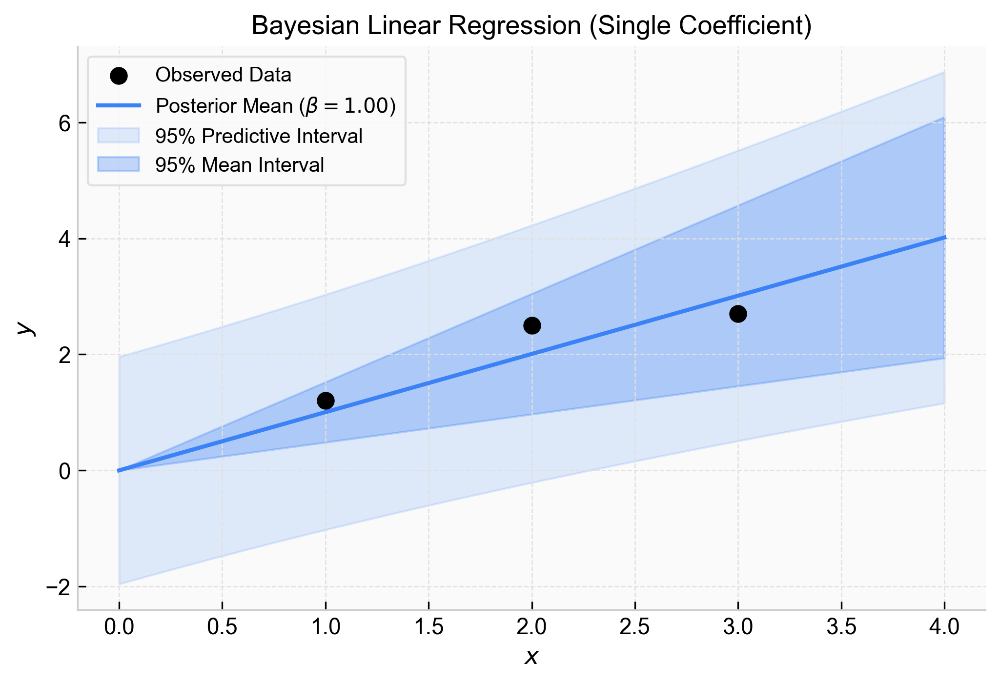

import Callout from '../../../../components/Callout.astro';

Ever fit a line to three data points and wondered how much you should actually trust it? Ordinary least squares gives you a single "best" line, but ignores the massive uncertainty of small samples.

This note derives **Bayesian linear regression** via its simplest form: a linear regression with **one coefficient** $\beta$ and no intercept:

$$
y_i = \beta x_i + \epsilon_i
$$

## The Setup

Suppose we observe data:

$$
D = \{(x_1,y_1), (x_2,y_2), \dots, (x_n,y_n)\}
$$

We assume the data are generated by a linear process with some Gaussian noise $\epsilon_i \sim \mathcal{N}(0,\sigma^2)$:

$$
y_i = \beta x_i + \epsilon_i
$$

<Callout type="note" title="What changes if we include an intercept?">
With an intercept, the model would be:

$$ y_i = \alpha + \beta x_i + \epsilon_i $$

Then we would need a joint prior over both $\alpha$ and $\beta$.
The same logic still applies, but the posterior becomes a multivariate Gaussian instead of a one-dimensional Gaussian. We're keeping things as simple as possible in this note.
</Callout>

## The Prior

Before seeing the data, we place a Normal prior over $\beta$:

$$
\beta \sim \mathcal{N}(\mu_0,\tau_0^2)
$$

The prior density is:

$$
P(\beta)
=
\frac{1}{\sqrt{2\pi\tau_0^2}}
\exp\left(
-\frac{(\beta-\mu_0)^2}{2\tau_0^2}
\right)
$$

Here, $\mu_0$ is the prior mean (where we expect $\beta$ to be) and $\tau_0^2$ is the prior variance (how strongly we believe that expectation).

## The Likelihood

The likelihood tells us how plausible the observed data are for each possible value of $\beta$.

Assuming the observations are conditionally independent given $\beta$, the likelihood of the entire dataset is the product of the individual probabilities:

$$
P(D \mid \beta)
=
\prod_{i=1}^n P(y_i \mid x_i,\beta)
$$

Substituting the Gaussian density gives:

$$
P(D \mid \beta)
=
(2\pi\sigma^2)^{-n/2}
\exp\left(
-\frac{1}{2\sigma^2}
\sum_{i=1}^n (y_i-\beta x_i)^2
\right)
$$

## The Posterior

Because the likelihood is Gaussian with respect to $\beta$ and the prior is Gaussian, this is a **Normal-Normal conjugate update**. 

By applying Bayes' rule ($P(\beta \mid D) \propto P(D \mid \beta)P(\beta)$), expanding the exponents, and completing the square, we find that the posterior is also a Normal distribution. The algebraic steps are identical to the standard [Normal-Normal Conjugate Prior](/tracks/bayesian-statistics/normal-normal-conjugate-prior/) derivation.

Skipping straight to the result, the posterior distribution is:

$$
\beta \mid D
\sim
\mathcal{N}(\mu_n,\tau_n^2)
$$

Where the posterior precision (inverse variance) is:

$$
\frac{1}{\tau_n^2}
=
\frac{1}{\sigma^2}\sum_{i=1}^n x_i^2
+
\frac{1}{\tau_0^2}
$$

And the posterior mean is:

$$
\mu_n
=
\tau_n^2
\left(
\frac{1}{\sigma^2}\sum_{i=1}^n x_i y_i
+
\frac{\mu_0}{\tau_0^2}
\right)
$$

### Interpreting the Posterior

The posterior precision update shows that:

> Posterior precision = data precision + prior precision.

The posterior becomes more certain when the prior is strong (small $\tau_0^2$), the observation noise is small (small $\sigma^2$), or the inputs contain more information (large $\sum x_i^2$).

<Callout type="note" title="Connection to Ordinary Least Squares">
In this no-intercept model, the ordinary least squares estimate is:

$$ \hat{\beta}_{OLS} = \frac{\sum_{i=1}^n x_i y_i}{\sum_{i=1}^n x_i^2} $$

If the prior variance $\tau_0^2$ becomes very large, the prior precision $\frac{1}{\tau_0^2}$ approaches zero. In that weak-prior limit, the posterior mean approaches the ordinary least squares estimate.
</Callout>

## Making Predictions

Now suppose we want to predict the output for a new input $x_*$.

The model says:

$$
y_* = \beta x_* + \epsilon_*
$$

where $\epsilon_* \sim \mathcal{N}(0,\sigma^2)$.

In Bayesian linear regression, we don't just plug in a single point estimate for $\beta$. Instead, we average over all plausible values of $\beta$ using the posterior distribution. This gives us the **posterior predictive distribution**, which is also Normal.

### Predictive Mean

Taking expectations conditional on the observed data:

$$
\mathbb{E}[y_* \mid x_*,D]
=
\mathbb{E}[\beta x_* + \epsilon_* \mid D]
=
x_*\mu_n
$$

The predictive mean is simply the new input multiplied by the posterior mean coefficient.

### Predictive Variance

The predictive variance has two sources:
1. **Coefficient uncertainty**: we are not completely sure what $\beta$ is ($\mathrm{Var}(\beta x_* \mid D) = x_*^2\tau_n^2$).
2. **Observation noise**: even with the correct $\beta$, future observations are noisy ($\mathrm{Var}(\epsilon_*) = \sigma^2$).

Since $\beta$ and $\epsilon_*$ are independent, we add the variances:

$$
\mathrm{Var}(y_* \mid x_*,D)
=
x_*^2\tau_n^2 + \sigma^2
$$

So the posterior predictive distribution is:

$$
y_* \mid x_*,D
\sim
\mathcal{N}
\left(
x_*\mu_n,
x_*^2\tau_n^2+\sigma^2
\right)
$$

## Credible Intervals for Predictions

Since the posterior predictive distribution is Normal, a 95% credible interval for a future observation $y_*$ is:

$$
x_*\mu_n
\pm
1.96\sqrt{x_*^2\tau_n^2+\sigma^2}
$$

This interval answers the question: *What is the likely future observed value at $x_*$?*

### Why the Intervals Grow with $x$

Notice that the width of the interval depends on $x_*$. The further $x_*$ is from zero, the wider the interval becomes. This creates a "bowtie" or "megaphone" shape around the regression line.

Mathematically, this happens because the variance of our prediction scales with $x_*^2$. Since $\text{Var}(\beta x_*) = x_*^2 \text{Var}(\beta)$, the standard deviation grows linearly with $|x_*|$.

Intuitively, we are only estimating the slope $\beta$ and forcing the line to pass exactly through the origin (no intercept). Imagine holding a long stick pinned at $(0,0)$. Because we are slightly uncertain about the exact angle of the slope, the stick wiggles. Right at the origin, the stick doesn't move at all. But the further out you look along the stick, that same tiny wiggle in the angle translates into a massive vertical swing. 

If our model included an uncertain intercept, the line wouldn't be perfectly pinned at $(0,0)$, so the uncertainty at the origin would no longer be zero, but the interval would still widen at the edges due to the slope uncertainty.

<Callout type="note" title="Credible interval for the mean response only">
If we only want uncertainty about the mean line itself (i.e. what is the likely mean response at $x_*$), we exclude the observation noise $\sigma^2$.

A 95% credible interval for the mean response $\beta x_*$ is:

$$ x_*\mu_n \pm 1.96\sqrt{x_*^2\tau_n^2} $$

</Callout>

<Callout type="example" title="Worked Example: Fitting a Bayesian Line" collapsible defaultOpen={false}>
Let's ground this in a concrete example. 

*Assumes known observation noise $\sigma = 1.0$ and a Normal prior $\beta \sim \mathcal{N}(0, 2.0^2)$.*

We observe three data points:

| Step | Variable | Value |
|---|---|---|
| 0 | $x$ | $[1.0, 2.0, 3.0]$ |
| 0 | $y$ | $[1.2, 2.5, 2.7]$ |

We first calculate the summary statistics from the data:
- $\sum x_i^2 = 1.0^2 + 2.0^2 + 3.0^2 = 14.0$
- $\sum x_i y_i = (1.0 \times 1.2) + (2.0 \times 2.5) + (3.0 \times 2.7) = 14.3$

Next, we calculate the posterior precision:

$$
\frac{1}{\tau_n^2} = \frac{14.0}{1.0^2} + \frac{1}{2.0^2} = 14.0 + 0.25 = 14.25
$$

So the posterior variance is $\tau_n^2 = \frac{1}{14.25} \approx 0.070$.

Now we calculate the posterior mean:

$$
\mu_n = 0.070 \times \left( \frac{14.3}{1.0^2} + \frac{0}{2.0^2} \right) = 0.070 \times 14.3 \approx 1.00
$$

Our posterior distribution for the coefficient is $\beta \mid D \sim \mathcal{N}(1.00, 0.070)$.

We can visualize the resulting line of best fit alongside the credible intervals:

The dark blue line represents the posterior mean ($\beta \approx 1.00$). The inner shaded region shows the uncertainty of the line itself (the mean response), which grows wider as we move away from the origin. The outer shaded region shows the predictive interval, which includes the constant observation noise ($\sigma = 1.0$) and represents where we expect 95% of future data points to fall.
</Callout>

---
