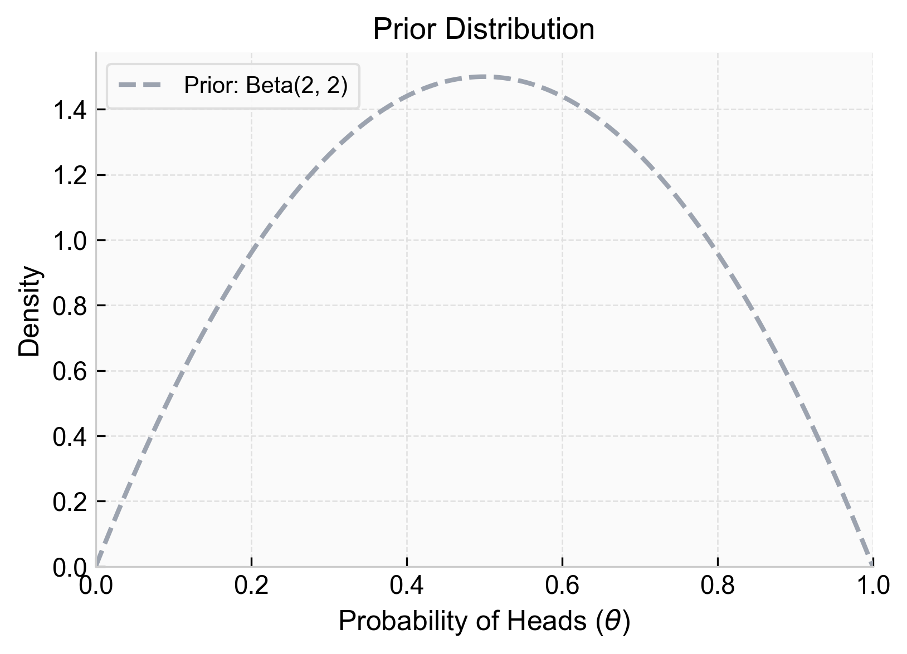
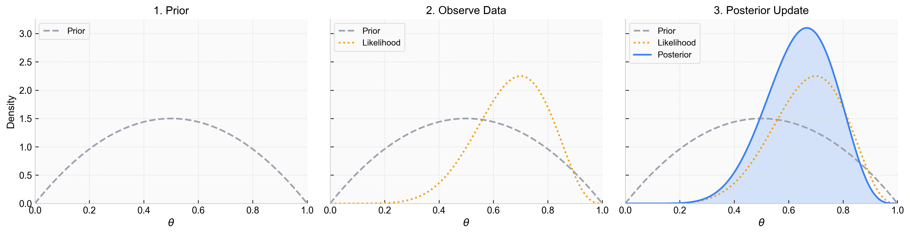
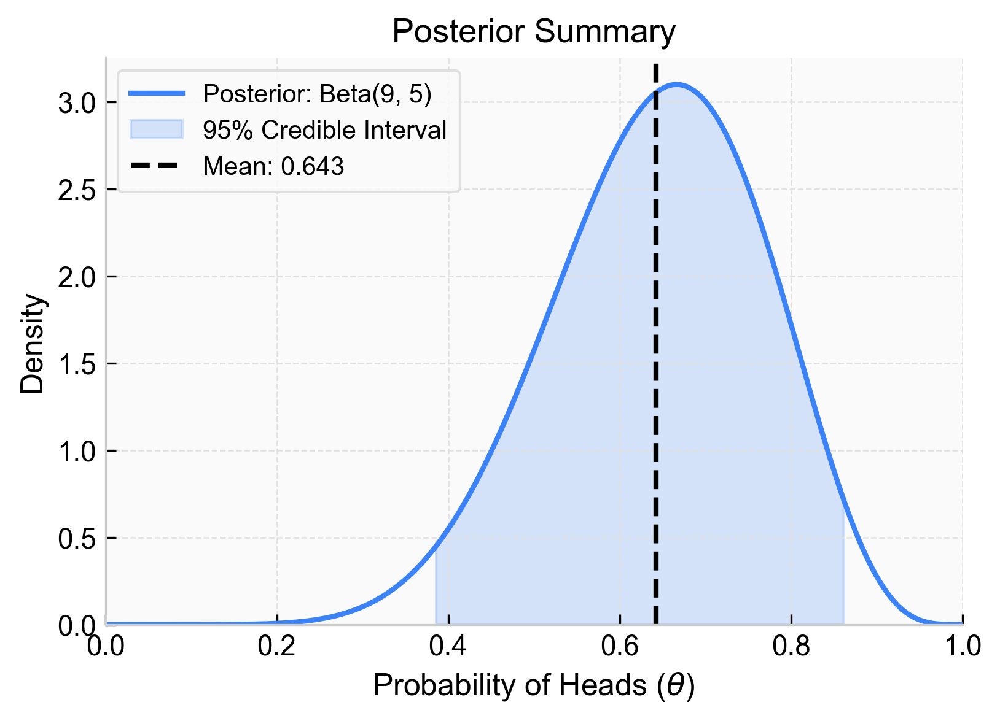

---
title: Beta-Bernoulli Conjugate Prior
sidebar:
  order: 2
---
import Callout from '@components/Callout.astro';

We've seen how [Bayes Rule](/tracks/bayesian-statistics/bayes-rule/) allows us to update the probability of a discrete event. Now, instead of calculating a single posterior probability, we calculate a **posterior probability distribution**.

## The Problem

Consider a coin flip. The coin can land heads or tails. We want to estimate $\theta$, the true probability that the coin lands on heads.

A frequentist approach to this problem is to flip the coin $n$ times, observe $h$ heads, and state that $\theta = h/n$. 

A Bayesian approach allows us to factor in extra considerations before we even flip the coin. Is the coin fair? Has it been tampered with? Is it weighted? We can bake this prior information into our probability estimations. 

## The Bayesian Framework

Substituting our specific variables (data $D$ and probability of heads $\theta$) into Bayes' rule gives us the continuous form for updating a parameter:

$$
P(\theta|D) = \frac{P(D|\theta)P(\theta)}{P(D)}
$$

Each component of this equation plays a specific role:

<Callout type="info" title="The Likelihood: $P(D|\theta)$">
The probability of observing the data $D$ if the parameter were exactly $\theta$. Since a coin flip is a binary event, this is a Bernoulli distribution. If we observe $h$ heads and $t$ tails, the probability mass function (PMF) is:

$$
P(D|\theta) = \theta^h (1-\theta)^t
$$

</Callout>

<Callout type="note" title="The Prior: $P(\theta)$">
Our subjective assumptions about the parameter before seeing any data. We want to pick a distribution that will merge well with our likelihood. For a Bernoulli likelihood, the perfect match is the **Beta distribution**, defined on the interval $[0, 1]$. It has two parameters, $\alpha$ and $\beta$, which control its shape:

$$
P(\theta) = \text{Beta}(\theta|\alpha, \beta) = \frac{1}{B(\alpha, \beta)} \theta^{\alpha-1} (1-\theta)^{\beta-1}
$$

</Callout>

<Callout type="note" title="The Scaling Constant: $P(D)$">
The total probability of observing the data across all possible values of $\theta$. This ensures the posterior is a valid probability distribution that integrates to 1. Because $\theta$ is continuous, we use an integral over the likelihood and the prior:

$$
P(D) = \int P(D|\theta)P(\theta) d\theta
$$

Calculating this integral is often complex, which is why we carefully select a prior that makes it tractable.
</Callout>

### The Posterior: $P(\theta|D)$

The posterior is our updated belief about $\theta$ after observing the data.

<Callout type="info" title="Derivation: Beta-Bernoulli Posterior" collapsible defaultOpen={false}>

**Step 1 — Write Bayes' Rule in Full**

Bayes' rule says:

$$
P(\theta \mid D)
=
\frac{P(D \mid \theta)P(\theta)}
{\int_0^1 P(D \mid \theta)P(\theta)\,d\theta}
$$

Here, $\theta$ is the unknown probability of success, and $D$ is an observed sequence of Bernoulli outcomes.

---

**Step 2 — Write the Prior**

The Beta prior density is:

$$
P(\theta)
=
\frac{1}{B(\alpha, \beta)}
\theta^{\alpha - 1}(1-\theta)^{\beta - 1}
$$

where $B(\alpha, \beta)$ is the Beta function:

$$
B(\alpha, \beta)
=
\int_0^1 \theta^{\alpha - 1}(1-\theta)^{\beta - 1}\,d\theta
$$

The parameters $\alpha$ and $\beta$ determine the prior shape. Informally, $\alpha$ contributes prior weight toward successes, while $\beta$ contributes prior weight toward failures.

---

**Step 3 — Write the Likelihood for a Fixed Bernoulli Sequence**

Suppose the observed data $D$ are a specific sequence of Bernoulli outcomes containing:

- $h$ successes
- $t$ failures

For a fixed observed sequence, the likelihood is the probability of that exact sequence:

$$
P(D \mid \theta)
=
\theta^h(1-\theta)^t
$$

Each success contributes a factor of $\theta$, and each failure contributes a factor of $1-\theta$.

---

**Step 4 — Substitute Prior and Likelihood into Bayes' Rule**

Start with:

$$
P(\theta \mid D)
=
\frac{P(D \mid \theta)P(\theta)}
{\int_0^1 P(D \mid \theta)P(\theta)\,d\theta}
$$

Substitute the Bernoulli likelihood:

$$
P(D \mid \theta)
=
\theta^h(1-\theta)^t
$$

and the Beta prior:

$$
P(\theta)
=
\frac{1}{B(\alpha,\beta)}
\theta^{\alpha-1}(1-\theta)^{\beta-1}
$$

This gives:

$$
P(\theta \mid D)
=
\frac{
\left[\theta^h(1-\theta)^t\right]
\left[\frac{1}{B(\alpha,\beta)}\theta^{\alpha-1}(1-\theta)^{\beta-1}\right]
}
{\int_0^1
\left[\theta^h(1-\theta)^t\right]
\left[\frac{1}{B(\alpha,\beta)}\theta^{\alpha-1}(1-\theta)^{\beta-1}\right]
d\theta}
$$

---

**Step 5 — Combine Powers in the Numerator**

In the numerator, combine terms with the same base:

$$
\theta^h\theta^{\alpha-1}
=
\theta^{h+\alpha-1}
$$

and:

$$
(1-\theta)^t(1-\theta)^{\beta-1}
=
(1-\theta)^{t+\beta-1}
$$

So the numerator becomes:

$$
\frac{1}{B(\alpha,\beta)}
\theta^{\alpha+h-1}(1-\theta)^{\beta+t-1}
$$

---

**Step 6 — Combine Powers in the Denominator**

The denominator is:

$$
\int_0^1
\left[\theta^h(1-\theta)^t\right]
\left[\frac{1}{B(\alpha,\beta)}\theta^{\alpha-1}(1-\theta)^{\beta-1}\right]
d\theta
$$

Combine powers inside the integral in the same way:

$$
\int_0^1
\frac{1}{B(\alpha,\beta)}
\theta^{\alpha+h-1}(1-\theta)^{\beta+t-1}
d\theta
$$

Since $\frac{1}{B(\alpha,\beta)}$ does not depend on $\theta$, it can be pulled outside the integral:

$$
\frac{1}{B(\alpha,\beta)}
\int_0^1
\theta^{\alpha+h-1}(1-\theta)^{\beta+t-1}
d\theta
$$

The remaining integral is another Beta function:

$$
\int_0^1
\theta^{\alpha+h-1}(1-\theta)^{\beta+t-1}
d\theta
=
B(\alpha+h,\beta+t)
$$

Therefore the denominator is:

$$
\frac{B(\alpha+h,\beta+t)}{B(\alpha,\beta)}
$$

---

**Step 7 — Substitute the Simplified Numerator and Denominator**

From Step 5, the numerator is:

$$
\frac{1}{B(\alpha,\beta)}
\theta^{\alpha+h-1}(1-\theta)^{\beta+t-1}
$$

From Step 6, the denominator is:

$$
\frac{B(\alpha+h,\beta+t)}{B(\alpha,\beta)}
$$

Substitute both back into Bayes' rule:

$$
P(\theta \mid D)
=
\frac{
\frac{1}{B(\alpha,\beta)}
\theta^{\alpha+h-1}(1-\theta)^{\beta+t-1}
}
{
\frac{B(\alpha+h,\beta+t)}{B(\alpha,\beta)}
}
$$

Dividing by a fraction is the same as multiplying by its reciprocal:

$$
P(\theta \mid D)
=
\frac{1}{B(\alpha,\beta)}
\theta^{\alpha+h-1}(1-\theta)^{\beta+t-1}
\cdot
\frac{B(\alpha,\beta)}{B(\alpha+h,\beta+t)}
$$

The $B(\alpha,\beta)$ terms cancel:

$$
P(\theta \mid D)
=
\frac{1}{B(\alpha+h,\beta+t)}
\theta^{\alpha+h-1}(1-\theta)^{\beta+t-1}
$$

---

**Step 8 — Recognize the Posterior Distribution**

The Beta density has the form:

$$
\mathrm{Beta}(\theta \mid a,b)
=
\frac{1}{B(a,b)}
\theta^{a-1}(1-\theta)^{b-1}
$$

The posterior we derived is:

$$
P(\theta \mid D)
=
\frac{1}{B(\alpha+h,\beta+t)}
\theta^{\alpha+h-1}(1-\theta)^{\beta+t-1}
$$

This has the same form as a Beta density with:

$$
a = \alpha + h
$$

and:

$$
b = \beta + t
$$

Therefore:

$$
P(\theta \mid D)
=
\mathrm{Beta}(\theta \mid \alpha+h, \beta+t)
$$

</Callout>

The posterior can be formalized as:

$$
P(\theta \mid D) = \frac{1}{B(\alpha+h,\beta+t)} \theta^{\alpha+h-1}(1-\theta)^{\beta+t-1}
$$

Which is a Beta distribution with a parameter update based on the observed data. 

<Callout type="note" title="Conjugacy">
When the prior and posterior belong to the same algebraic family (e.g. Beta to Beta), the prior is called a **conjugate prior** for the likelihood. 

Conjugacy means we can just use the final, clean update formula as we gather more data, instead of numerically calculating complex integrals *(from the collapsed derivation above)* each time.
</Callout>

## Point Estimates and Intervals

The posterior is our final result, and it is a full distribution. If we want point estimates, we have to get the mean of this distribution. 

The expected value (mean) of a Beta distribution is calculated as:

$$
\text{Mean} = \frac{\alpha}{\alpha + \beta}
$$

If we want intervals, we can get them directly from the distribution itself. By finding the left and right percentiles that we desire (e.g., the 2.5th and 97.5th percentiles), we obtain a credible interval. We can also get direct quantile predictions instead of looking for the mean or other landmarks.

<Callout type="example" title="Worked Example: Updating Beliefs about a Coin" collapsible defaultOpen={false}>
Let's assume the coin is fair. This corresponds to a Beta distribution with parameters $\alpha = 2$ and $\beta = 2$. These parameters result in a fairness assumption because they create a symmetric curve centered exactly at $\theta = 0.5$. The curve is relatively wide, reflecting a "weak" prior—we think it's fair, but we aren't absolutely certain.

We then receive some data $D$. We flip the coin 10 times, and observe 7 heads and 3 tails:

| Observation | Result |
| :--- | :--- |
| 1 | H |
| 2 | T |
| 3 | H |
| 4 | H |
| 5 | T |
| 6 | H |
| 7 | H |
| 8 | T |
| 9 | H |
| 10 | H |

We calculate the posterior, which is a Beta distribution with the relative additions to the parameters:

$$
P(\theta|D) = \text{Beta}(\alpha + h, \beta + t)
$$

Subbing in our actual numbers ($\alpha=2, \beta=2, h=7, t=3$):

$$
P(\theta|D) = \text{Beta}(2 + 7, 2 + 3) = \text{Beta}(9, 5)
$$

This results in a new output distribution, our posterior.

The posterior is a compromise between the prior (centered at 0.5) and the likelihood of the observed data (centered at 0.7). 

**Results:**

Here is how we can extract results from this posterior distribution:

- For a point estimate, the mean of our posterior distribution is $\frac{9}{9+5} \approx 0.643$
- For a prediction interval, simply grab the percentiles of the posterior distribution. Above, we can state that there is a 95% probability that the true value of $\theta$ lies within the shaded area.
</Callout>

---

