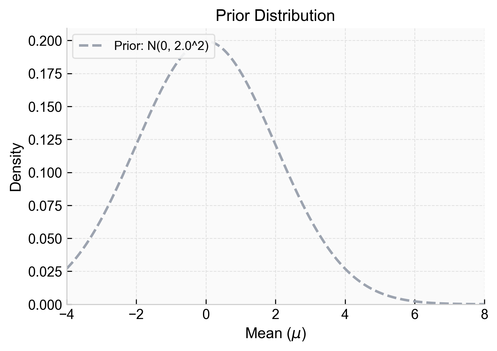
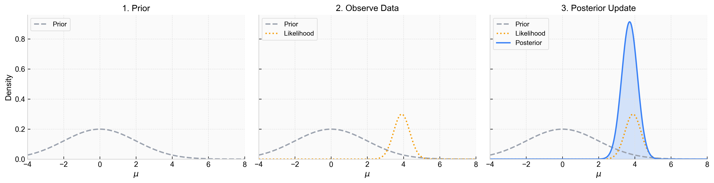
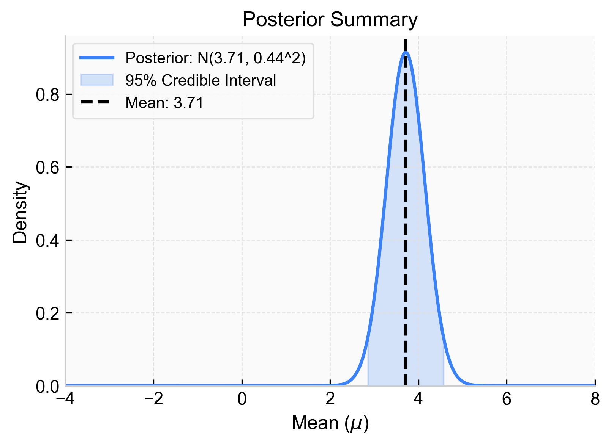

---
title: Normal-Normal Conjugate Prior
sidebar:
  order: 3
---
import Callout from '@components/Callout.astro';

Following the same principles as the [Beta-Bernoulli Conjugate Prior](/tracks/bayesian-statistics/beta-bernoulli-conjugate-prior/), we can apply Bayesian updating to continuous data. The mechanics are the same — prior beliefs are updated with observed evidence — but now both the data and the parameter of interest are continuous, so the distributions involved are Normal rather than Beta and Bernoulli.

## The Problem

Consider a scenario where we are measuring the height of adult men in a specific city. We want to estimate $\mu$, the true average height of this population. 

A frequentist approach to this problem is to measure $n$ men, calculate the sample mean $\bar{y}$, and state that $\mu = \bar{y}$. 

A Bayesian approach allows us to factor in extra considerations before we even take our first measurement. Do we know the national average height? Do we suspect this city's population might be taller or shorter than average? We can bake this prior information into our estimations.

## The Bayesian Framework

Substituting our specific variables (data $D$ and true average height $\mu$) into Bayes' rule gives us the continuous form for updating the parameter:

$$
P(\mu|D) = \frac{P(D|\mu)P(\mu)}{P(D)}
$$

Each component of this equation plays a specific role:

<Callout type="info" title="The Likelihood: $P(D|\mu)$">
The probability of observing the data $D$ if the parameter were exactly $\mu$. Assuming the data is normally distributed with a known variance $\sigma^2$, the likelihood of observing $n$ independent data points $y = \{y_1, y_2, \dots, y_n\}$ is the product of their individual normal probabilities:

$$
P(D|\mu) = \prod_{i=1}^n \frac{1}{\sqrt{2\pi\sigma^2}} \exp\left( -\frac{1}{2\sigma^2} (y_i - \mu)^2 \right)
$$

</Callout>

<Callout type="note" title="The Prior: $P(\mu)$">
Our subjective assumptions about the parameter before seeing any data. We want to pick a distribution that will merge well with our likelihood. For a normal likelihood, the perfect match is another **Normal distribution**. It has two parameters, a prior mean $\mu_0$ and a prior variance $\sigma_0^2$, which control its shape:

$$
P(\mu) = N(\mu_0, \sigma_0^2) = \frac{1}{\sqrt{2\pi\sigma_0^2}} \exp\left( -\frac{1}{2\sigma_0^2} (\mu - \mu_0)^2 \right)
$$

</Callout>

<Callout type="note" title="The Scaling Constant: $P(D)$">
The total probability of observing the data across all possible values of $\mu$. This ensures the posterior is a valid probability distribution that integrates to 1. Because $\mu$ is continuous, we use an integral over the likelihood and the prior:

$$
P(D) = \int_{-\infty}^{\infty} P(D|\mu)P(\mu) d\mu
$$

Calculating this integral is often complex, which is why we carefully select a prior that makes it tractable.
</Callout>

<Callout type="note" title="Precision vs Variance">
When working with normal distributions in Bayesian statistics, it is often easier to work with **precision** ($\tau$) instead of variance ($\sigma^2$). Precision is simply the inverse of variance:

$$
\tau = \frac{1}{\sigma^2}
$$

A high precision means a low variance (we are very certain). A low precision means a high variance (we are very uncertain). Let's define $\tau_0 = 1/\sigma_0^2$ (Prior precision) and $\tau = 1/\sigma^2$ (Data precision for a single observation).
</Callout>

### The Posterior: $P(\mu|D)$

The posterior is our updated belief about $\mu$ after observing the data. Let's put this all together and derive the posterior step-by-step.

<Callout type="info" title="Derivation: Normal-Normal Posterior" collapsible defaultOpen={false}>

**Step 1 — Write Bayes' Rule in Full**

Bayes' rule says:

$$
P(\mu \mid D)
=
\frac{P(D \mid \mu)P(\mu)}
{\int_{-\infty}^{\infty} P(D \mid \mu)P(\mu)\,d\mu}
$$

Here, $\mu$ is the unknown mean, and $D$ is an observed sequence of normal outcomes $y = \{y_1, \dots, y_n\}$.

---

**Step 2 — Write the Prior**

The Normal prior density is:

$$
P(\mu)
=
\frac{1}{\sqrt{2\pi\sigma_0^2}} \exp\left( -\frac{1}{2\sigma_0^2} (\mu - \mu_0)^2 \right)
$$

---

**Step 3 — Write the Likelihood for a Fixed Normal Sequence**

For a fixed observed sequence of $n$ independent points, the likelihood is the product of their individual probabilities:

$$
P(D \mid \mu)
=
\prod_{i=1}^n \frac{1}{\sqrt{2\pi\sigma^2}} \exp\left( -\frac{1}{2\sigma^2} (y_i - \mu)^2 \right)
$$

We can pull the constant out of the product and sum the exponents:

$$
P(D \mid \mu)
=
\left( \frac{1}{\sqrt{2\pi\sigma^2}} \right)^n \exp\left( -\frac{1}{2\sigma^2} \sum_{i=1}^n (y_i - \mu)^2 \right)
$$

---

**Step 4 — Substitute Prior and Likelihood into the Numerator**

We focus on the numerator $P(D \mid \mu)P(\mu)$. Since we only care about the shape of the distribution with respect to $\mu$, we can drop any multiplicative constants that do not contain $\mu$ (they will cancel out with the denominator later). We use the proportionality symbol $\propto$:

$$
P(\mu \mid D) \propto \exp\left( -\frac{1}{2\sigma^2} \sum_{i=1}^n (y_i - \mu)^2 \right) \exp\left( -\frac{1}{2\sigma_0^2} (\mu - \mu_0)^2 \right)
$$

---

**Step 5 — Combine the Exponents**

Since $e^A \cdot e^B = e^{A+B}$, we can add the terms inside the exponentials:

$$
P(\mu \mid D) \propto \exp\left( -\frac{1}{2} \left[ \frac{1}{\sigma^2} \sum_{i=1}^n (y_i - \mu)^2 + \frac{1}{\sigma_0^2} (\mu - \mu_0)^2 \right] \right)
$$

---

**Step 6 — Expand the Squares**

We expand the quadratic terms inside the bracket:

$$
\sum_{i=1}^n (y_i - \mu)^2 = \sum_{i=1}^n (y_i^2 - 2y_i\mu + \mu^2) = \sum_{i=1}^n y_i^2 - 2\mu \sum_{i=1}^n y_i + n\mu^2
$$

And for the prior term:

$$
(\mu - \mu_0)^2 = \mu^2 - 2\mu\mu_0 + \mu_0^2
$$

Substitute these back into the exponent bracket:

$$
\frac{1}{\sigma^2} \left( \sum y_i^2 - 2\mu \sum y_i + n\mu^2 \right) + \frac{1}{\sigma_0^2} \left( \mu^2 - 2\mu\mu_0 + \mu_0^2 \right)
$$

---

**Step 7 — Collect Terms by Powers of $\mu$**

We group the terms by $\mu^2$ and $\mu$. Any term that does not contain $\mu$ (like $\sum y_i^2$ or $\mu_0^2$) is a constant with respect to $\mu$ and can be absorbed into the proportionality constant outside the exponential.

Grouping the $\mu^2$ terms:

$$
\mu^2 \left( \frac{n}{\sigma^2} + \frac{1}{\sigma_0^2} \right)
$$

Grouping the $\mu$ terms:

$$
-2\mu \left( \frac{\sum y_i}{\sigma^2} + \frac{\mu_0}{\sigma_0^2} \right)
$$

So the exponent simplifies to:

$$
-\frac{1}{2} \left[ \mu^2 \left( \frac{n}{\sigma^2} + \frac{1}{\sigma_0^2} \right) - 2\mu \left( \frac{\sum y_i}{\sigma^2} + \frac{\mu_0}{\sigma_0^2} \right) \right] + C
$$

---

**Step 8 — Recognize the Posterior Distribution**

A normal distribution $N(\mu \mid \mu_n, \sigma_n^2)$ has a density proportional to:

$$
\exp\left( -\frac{1}{2\sigma_n^2} (\mu - \mu_n)^2 \right) \propto \exp\left( -\frac{1}{2} \left[ \mu^2 \left(\frac{1}{\sigma_n^2}\right) - 2\mu \left(\frac{\mu_n}{\sigma_n^2}\right) \right] \right)
$$

By matching the coefficients of $\mu^2$ and $\mu$ from Step 7 with this standard normal form, we can read off the posterior parameters:

**Matching the $\mu^2$ coefficient (Precision):**

$$
\frac{1}{\sigma_n^2} = \frac{1}{\sigma_0^2} + \frac{n}{\sigma^2}
$$

**Matching the $\mu$ coefficient (Mean):**

$$
\frac{\mu_n}{\sigma_n^2} = \frac{\mu_0}{\sigma_0^2} + \frac{\sum y_i}{\sigma^2}
$$

Solving for $\mu_n$:

$$
\mu_n = \sigma_n^2 \left( \frac{\mu_0}{\sigma_0^2} + \frac{\sum y_i}{\sigma^2} \right)
$$

---

**Step 9 — Rewrite Using Precisions**

Using our precision notation ($\tau_0 = 1/\sigma_0^2$ and $\tau = 1/\sigma^2$), the posterior parameters become beautifully simple.

**Posterior Precision:**

$$
\tau_n = \tau_0 + n\tau
$$

**Posterior Mean:**
Since $\sum y_i = n\bar{y}$, we can write:

$$
\mu_n = \frac{\tau_0 \mu_0 + n\tau \bar{y}}{\tau_n} = \frac{\tau_0 \mu_0 + n\tau \bar{y}}{\tau_0 + n\tau}
$$

</Callout>

The posterior can be formalized as (refer to the derivation above for interpretation of mean and standard deviation terms):

$$
P(\mu \mid D) = N(\mu \mid \mu_n, \sigma_n^2)
$$

Which is a Normal distribution with a parameter update based on the observed data.

When the prior and posterior belong to the same algebraic family (e.g. Normal to Normal), the prior is called a **conjugate prior** for the likelihood.

Conjugacy means we can just use the final, clean update formula as we gather more data, instead of numerically calculating complex integrals *(from the collapsed derivation above)* each time.

## Point Estimates and Intervals

The posterior is our final result, and it is a full distribution. If we want point estimates, we have to get the mean of this distribution.

The expected value (mean) of our normal posterior is simply its parameter $\mu_n$:

$$
\text{Mean} = \mu_n = \frac{\tau_0 \mu_0 + n\tau \bar{y}}{\tau_0 + n\tau}
$$

If we want intervals, we can get them directly from the distribution itself. By finding the left and right percentiles that we desire (e.g., the 2.5th and 97.5th percentiles of the normal distribution), we obtain a credible interval. We can also get direct quantile predictions instead of looking for the mean or other landmarks.

<Callout type="example" title="Worked Example: Estimating a Mean" collapsible defaultOpen={false}>
Let's assume the true mean is around 0. This corresponds to a normal distribution with parameters $\mu_0 = 0$ and $\sigma_0 = 2.0$. These parameters result in an assumption centered at 0, but with a relatively wide spread, reflecting a "weak" prior—we think it's near 0, but we aren't absolutely certain.

We then receive some data $D$. We assume the known data standard deviation is $\sigma=1.0$. We observe 5 data points:

| Observation | Result |
| :--- | :--- |
| 1 | 3.2 |
| 2 | 4.1 |
| 3 | 3.8 |
| 4 | 4.5 |
| 5 | 3.9 |

The sample mean is $\bar{y} = 3.9$.

We calculate the posterior, which is a normal distribution with the relative additions to the precisions:

- **Prior Precision:** $\tau_0 = 1 / 2^2 = 0.25$
- **Data Precision (Total):** $n\tau = 5 / 1.0^2 = 5.0$

Subbing in our actual numbers to find the posterior parameters:

**Posterior Precision:**

$$
\tau_n = 0.25 + 5.0 = 5.25
$$

Posterior variance is $\sigma_n^2 = 1 / 5.25 \approx 0.19$ (Standard deviation $\approx 0.44$).

**Posterior Mean:**

$$
\mu_n = \frac{(0.25 \times 0) + (5.0 \times 3.9)}{5.25} = \frac{19.5}{5.25} \approx 3.71
$$

This results in a new output distribution, our posterior.

The posterior is a compromise between the prior (centered at 0) and the likelihood of the observed data (centered at 3.9). 

Notice how the posterior mean (3.71) is pulled slightly away from the sample mean (3.9) towards the prior mean (0). This is called **shrinkage**. Because the data precision ($5.0$) is much larger than the prior precision ($0.25$), the data dominates the posterior, and the shrinkage is small. 

Also notice that the posterior is much sharper and taller than both the prior and the likelihood. This is a direct consequence of the precision update rule: $\tau_n = \tau_0 + n\tau$. Because precisions *add together*, the posterior precision is always strictly greater than both the prior precision and the data precision. By combining our prior knowledge with new evidence, we become *more certain* than we would be using either source of information alone.

**Results:**

Here is how we can extract results from this posterior distribution:

- For a point estimate, the mean of our posterior distribution is $3.71$.
- For a prediction interval, simply grab the percentiles of the posterior distribution. Above, we can state that there is a 95% probability that the true value of $\mu$ lies within the shaded area.
</Callout>

---

