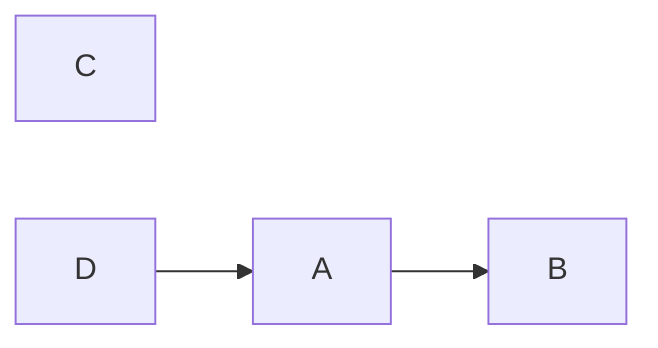
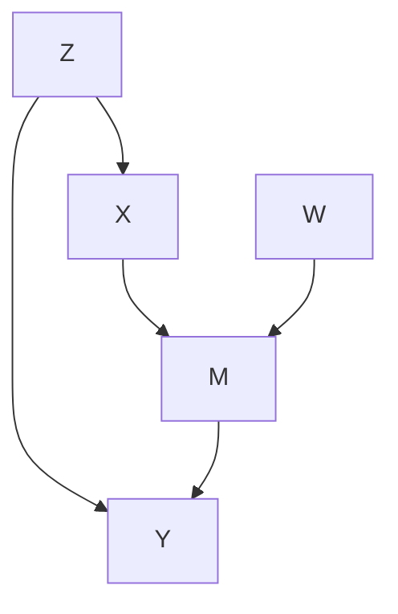
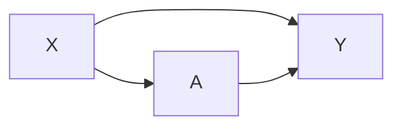
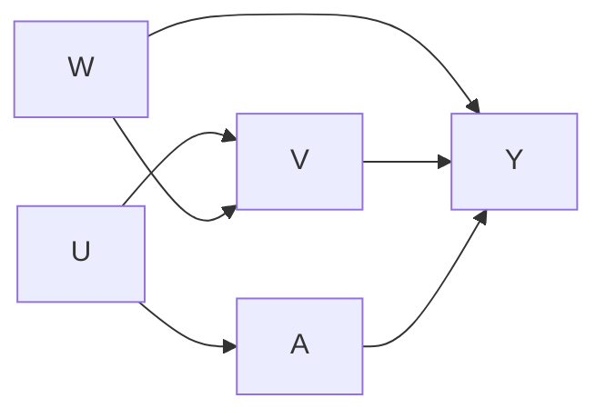
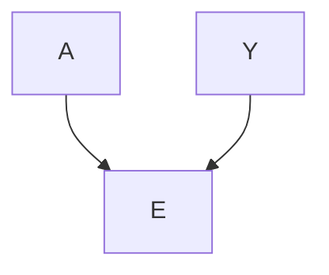
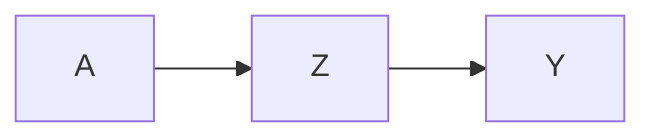

import Callout from '../../../../components/Callout.astro';

## Directed Acyclic Graphs (DAGs)

Directed Acyclic Graphs (DAGs) visually encode causal assumptions about a data-generating process.
- **Nodes** represent random variables.
- **Edges** (directed arrows) represent direct causal effects from one variable to another.

The "acyclic" property means there are no feedback loops—you can never follow arrows from a node and end up back at that same node.

## Joint Distribution and Factorization

A DAG dictates exactly how the joint probability distribution of all variables factorizes. The core rule is **Parent Conditioning**: the probability of any node is conditioned *only* on its direct parents in the graph.

To find the joint probability of all nodes in a DAG, we simply multiply the conditional probability of each node given its parents.

<Callout type="info" title="Derivation: Factorization and Markov Compatibility" collapsible defaultOpen={false}>

Why does this parent-conditioning rule work?

By the standard chain rule of probability, any joint distribution can be factored sequentially:

$$P(X_1, X_2, \ldots, X_n) = \prod_{i=1}^n P(X_i \mid X_1, \ldots, X_{i-1})$$

In a DAG, we can order the nodes topologically such that parents always come before children.

The **Local Markov Assumption** states that a variable is conditionally independent of all its non-descendants given its direct parents. Mathematically:

$$X_i \perp \{ \text{Non-Descendants}(X_i) \} \mid \text{Parents}(X_i)$$

By applying this assumption to the standard chain rule, all the extraneous upstream variables drop out of the conditioning set. We are left only with the direct parents:

$$P(X_1, \dots, X_n) = \prod_{i=1}^n P(X_i \mid \text{Parents}(X_i))$$

This is why we simply multiply the probability of each node given its parents.

</Callout>

### Simple Factorization

In this simple graph:
- $C$ and $D$ have no parents.
- $A$'s only parent is $D$.
- $B$'s only parent is $A$.

Applying the factorization rule, the joint distribution is:

$$P(A, B, C, D) = P(C) P(D) P(A \mid D) P(B \mid A)$$

### Complex Factorization

In this more complex structure:
- $Z$ and $W$ have no parents.
- $X$'s parent is $Z$.
- $M$'s parents are $X$ and $W$.
- $Y$'s parents are $Z$ and $M$.

The joint distribution factorizes as:

$$P(X, Y, Z, M, W) = P(Z) P(W) P(X \mid Z) P(M \mid X, W) P(Y \mid Z, M)$$

## Path Blocking and Causal Inference

Information flows between two variables if there is an unblocked path connecting them. A path is any sequence of edges, regardless of arrow direction. When estimating the causal effect of a treatment $A$ on an outcome $Y$, we must block all **backdoor paths** (spurious, non-causal paths) while deliberately leaving **directed paths** (causal pathways) open.

### 1. Confounders (The Fork)

A confounder $X$ is a common cause of both $A$ and $Y$ ($A \leftarrow X \rightarrow Y$).

- **Unconditioned**: Information flows between $A$ and $Y$ backwards through $X$. They are statistically dependent, creating a spurious correlation that masks the true causal effect. This is called a **backdoor path**.
- **Conditioned on X**: The path is blocked. To identify the pure causal effect of $A$ on $Y$, we *must* condition on $X$ to block this fork. This is the structural equivalent of the [ignorability](/tracks/causal-inference/fundamental-assumptions/) assumption.

#### Efficiency of Path Blocking

In complex DAGs, multiple sets of variables might successfully block all backdoor paths. We generally prefer the smallest or most precisely measured set of variables, known as an **efficient adjustment set**.

Here, $A$ and $Y$ share complex backdoor pathways. We could block them by controlling for the upstream variables $\{U, W\}$. Alternatively, we could simply control for the bottleneck node $V$. Because every single backdoor path from $A$ to $Y$ flows through $V$, conditioning on $V$ blocks all of them simultaneously with fewer variables.

### 2. Colliders (The Inverted Fork)

A collider $E$ is a common effect of two variables $A$ and $Y$ ($A \rightarrow E \leftarrow Y$).

- **Unconditioned**: Two causes of the same effect are naturally independent. The path is inherently blocked.
- **Conditioned on E**: Information flows. Conditioning on a collider *creates* a spurious dependence between $A$ and $Y$ ($A \not\perp Y \mid E$). We must *never* control for colliders.

<Callout type="info" title="Worked Example: Collider Bias" collapsible defaultOpen={false}>

Let $A$ be "Switch A is ON", $Y$ be "Switch B is ON", and $E$ be "Light is ON". Assume the light turns on if *either* switch is ON (an OR gate).

Unconditionally, the states of Switch A and Switch B are completely independent. However, if we condition on the light being ON ($E=1$), we create dependence: knowing Switch A is OFF gives us perfect information that Switch B *must* be ON. Conditioning on the collider $E$ opened an information path that didn't previously exist, creating a spurious correlation.

</Callout>

### 3. Mediators (The Chain)

A mediator $Z$ lies directly on the causal path from $A$ to $Y$ ($A \rightarrow Z \rightarrow Y$).

- **Unconditioned**: Information flows from $A$ to $Y$. The variables are statistically dependent because $A$ causes $Y$ through $Z$.
- **Conditioned on Z**: The path is blocked. Holding the mediator $Z$ constant breaks the chain ($A \perp Y \mid Z$).

Conditioning on $Z$ blocks the very mechanism by which $A$ affects $Y$. If our goal is to find the **total causal effect** of $A$ on $Y$, we must *never* control for mediators.

---
