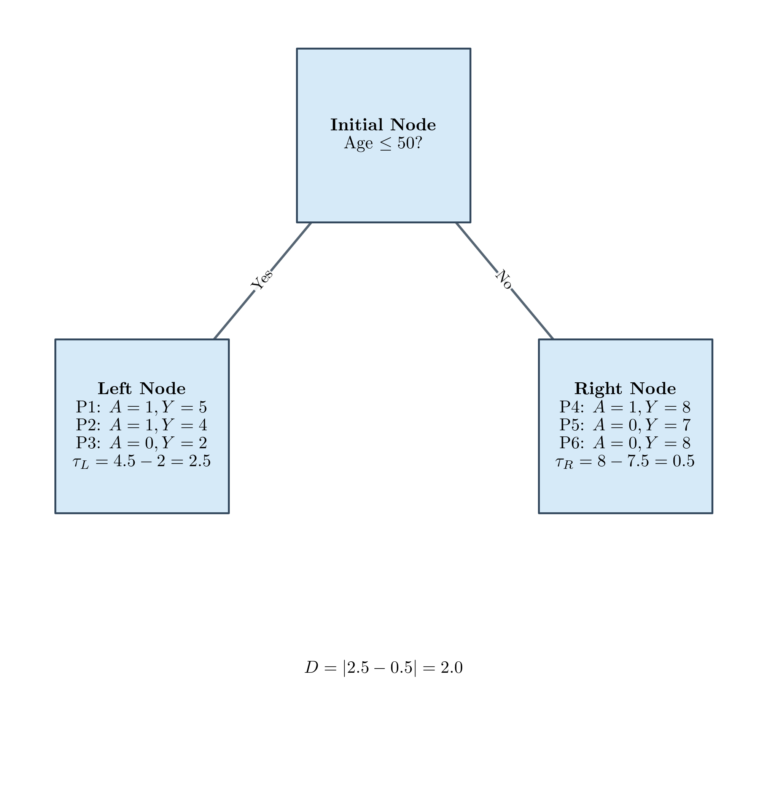
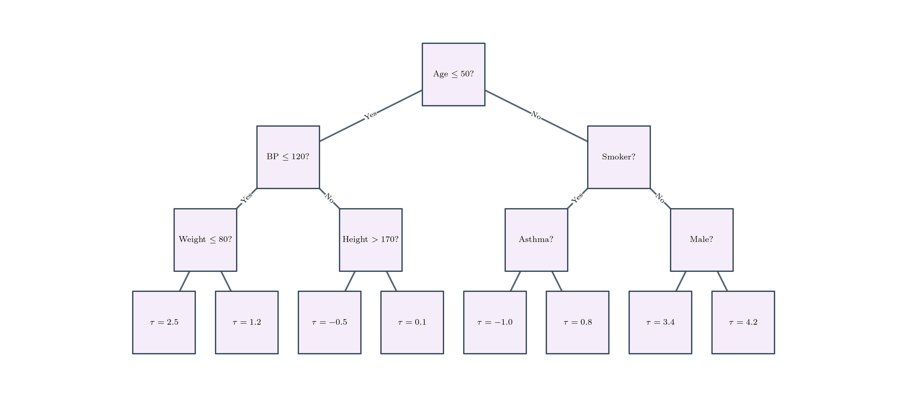
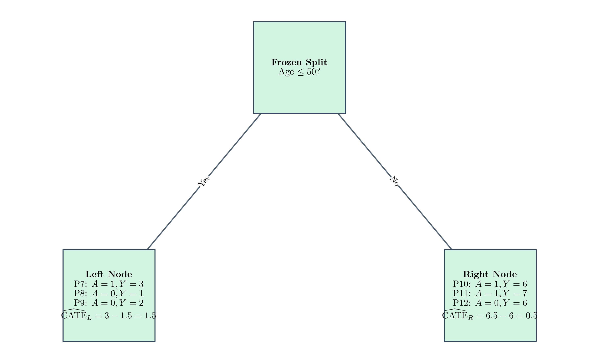

---
title: Causal Forests
sidebar:
  order: 4
---

import Callout from '@components/Callout.astro';

Standard decision trees split data to minimize mean squared error in regression or maximize Gini purity in classification. Causal forests split data such that the child nodes have higher treatment heterogeneity than the parent node.

## Splitting Logic

To estimate Heterogeneous Treatment Effects, a causal tree partitions the patient population into subgroups that respond differently to the treatment. The algorithm operates via a greedy, recursive process:

1. Iterate through all possible patient features $X$ and all possible threshold values for those features. For a given candidate feature and split (e.g., "Age $\le 50$"), partition the data into a left and right child node.
2. Compute the average outcome of treated patients minus the average outcome of untreated patients (Average Treatment Effect) in the left node, denoted as $\tau_L$, and in the right node, denoted as $\tau_R$.
3. Calculate the absolute difference between the treatment effects: $D = |\tau_L - \tau_R|$.
4. Select the feature and threshold combination that maximizes $D$.

As the algorithm repeats this process recursively on the child nodes, it creates dense segmentations of the original population, each with an estimated treatment effect.

<Callout type="info" title="Exploration: Extracting Subpopulations" collapsible defaultOpen={false}>

Once the tree is fully grown, we can extract subpopulations and rank them from highest to lowest treatment effect. This serves as a powerful discovery tool to identify which population stratifications hold the most promise for targeted interventions.

For example, based on the chart above, if a patient is $\le 50$ years old, has blood pressure $\le 120$, and weighs $> 80$ kg, the expected treatment effect for patients matching this profile is $1.2$.

However, extracting patient profiles from a single decision tree is extremely fragile:
1. Decision trees notoriously overfit to noise.
2. Extracting these kinds of stratifications is unlikely to be useful in clinical practice because it relies on hard cutoffs. For instance, if a patient is 49.9 years old, they end up in the $\le 50$ bucket, but if they are exactly 50 years old, they don't. That completely changes their predicted treatment pathway, even though the patient is clinically borderline.
3. If we recursively split over and over, the odds of stumbling on heterogeneous treatments just by chance is not small. You risk creating partitions of the population for whom you think there is a heterogeneous effect, but it is actually just random chance or noise.

</Callout>

## Honest Training Framework

If we use the exact same patients to determine the tree structure and to estimate the final predictive treatment effect in each leaf, our estimates will be heavily biased by selection. The tree will "cherry-pick" splits that artificially inflate the apparent treatment effect heterogeneity simply due to random noise in the training data.

Honest estimation (Wager & Athey, 2018) solves this by explicitly splitting the training data into two independent halves upfront:

1. **Splitting Sample ($S_1$)**: Used exclusively to perform the greedy splitting logic and define the rigid tree structure.
2. **Estimation Sample ($S_2$)**: We extract the rule set from the fully grown $S_1$ tree and apply it to the fresh $S_2$ data. The final, unbiased predictive treatment effect for a leaf is calculated using only the $S_2$ patients that fall into it based on those rules.

<Callout type="info" title="Exploration: The Bias-Variance Trade-Off" collapsible defaultOpen={false}>

Honest estimation represents a strict bias-variance trade-off. By splitting the sample, the training phase has access to 50% less data, which inherently increases the variance of our estimates. However, this sacrifice is required to completely eliminate the overfitting bias, ensuring our final estimates are statistically valid out-of-sample.

</Callout>

## From Trees to Forests

A single causal tree is highly interpretable but suffers from high variance. Causal forests solve this by generating thousands of these honest causal trees. Each tree is trained on a random bootstrap subsample of the data, and at each split, only a random subset of covariates is considered.

To generate a final prediction for a new patient, we apply the rule sets of every single tree in the forest to that patient and average the resulting leaf estimates.

We now have a trained predictor for the conditional average treatment effect of every patient. This differs from a traditional [meta-learner](/tracks/causal-inference/heterogeneous-treatment-effects/introduction-and-basic-meta-learners/) because we explicitly trained the model on heterogeneous divergence, rather than just training it on the prediction accuracy of the treatment outcome. This model is specifically trained to identify heterogeneous treatment neighborhoods.

<Callout type="info" title="Exploration: Feature Importance" collapsible defaultOpen={false}>

Because causal forests are ensembles of many trees, we can extract the most important features from the random forest. This helps us understand which features tend to drive a split in how the treatment affects patients, shedding light on the underlying drivers of treatment effect heterogeneity.

</Callout>

## Splitting Criterion Disclaimer

In the earlier sections, we used the simple absolute difference $D = |\tau_L - \tau_R|$ as our splitting criterion to explain the intuitive goal behind causal trees.

In practice, $D$ is a poor splitting criterion because it incentivizes extreme partitions. It encourages the model to create tiny nodes that naturally yield noisy, large treatment effects, ultimately rewarding outlier behavior rather than true heterogeneity.

Modern production packages (like `EconML` or `grf`) use much more robust variance-based or gradient-based splitting logic.

## Preprocessing

In the prior explanations, we simplified things by assuming we train a causal forest model directly on the raw data.

In reality, it is common to first train an outcome predicting model $\hat{m}(X)$ and a propensity scoring model $\hat{e}(X)$. We then train the causal forest on the de-residualized data:

$$
\tilde{Y} = Y - \hat{m}(X)
$$

$$
\tilde{A} = A - \hat{e}(X)
$$

---

