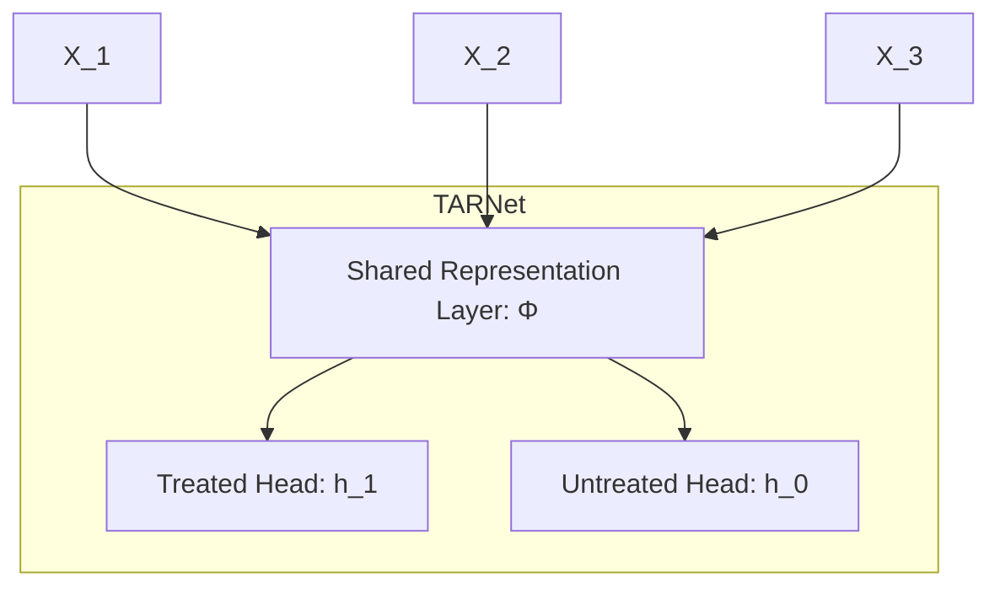
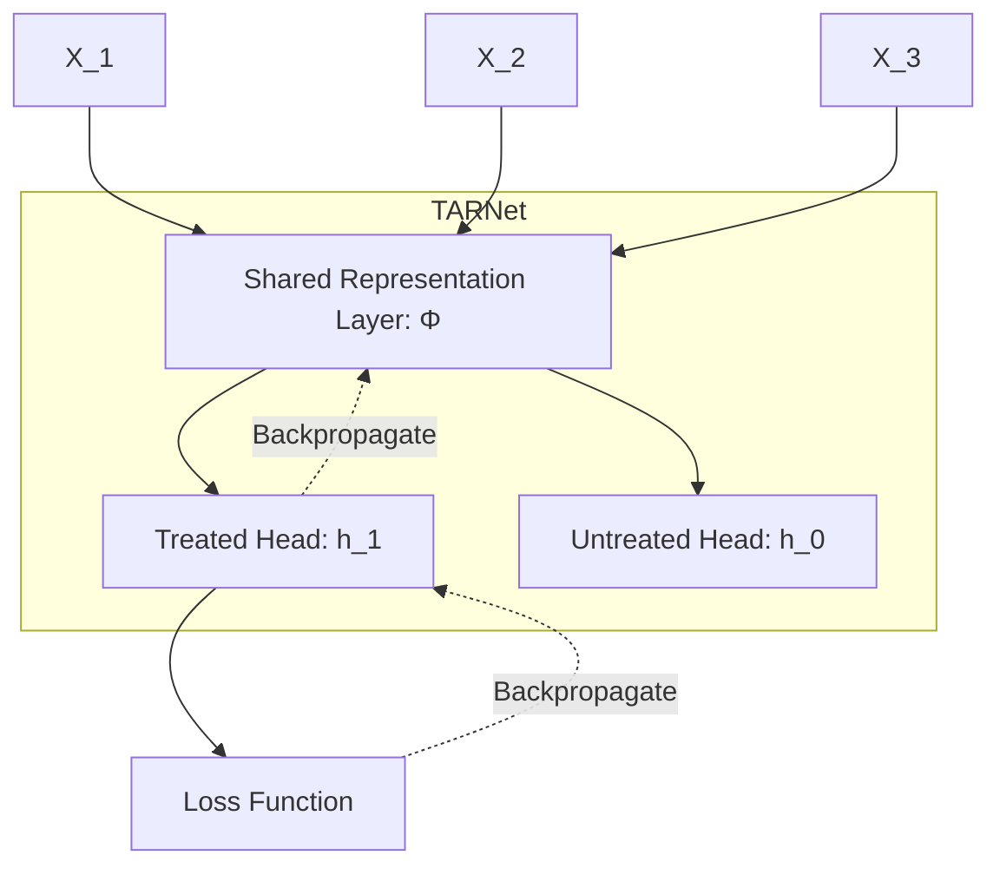

---
title: TARNet
sidebar:
  order: 2
---

import Callout from '@components/Callout.astro';

## Rationale

S-learners risk ignoring the treatment variable entirely during training. T-learners split the data, starving each model of observations if treatment groups are small or imbalanced. TARNet resolves this by merging the two approaches: it uses a shared representation layer (like an S-learner) to maximize data usage, and distinct treatment heads (like a T-learner) to explicitly capture heterogeneous effects.

## Architecture

TARNet relies on a branched neural network structure.

Covariates $X$ pass through the shared representation layer $\Phi$ regardless of treatment status. The output is then routed exclusively to the treated head $h_1$ or the untreated head $h_0$ based on the patient's actual treatment assignment.

<Callout type="warning" title="Treatment assignment routing">

The treatment assignment variable $A$ is **never** included in the $X$ covariates passed to the model. It is only used externally to route the patient to either $h_1$ or $h_0$.

</Callout>

<Callout type="info" title="What is a representation layer?" collapsible defaultOpen={false}>

Both the shared representation layer and the separate heads are simply collections of neural network hidden layers. Their internal architectures (number of layers, nodes, activation functions) can be arbitrarily complex, provided the overarching "shared trunk branching into two heads" structure is maintained.

</Callout>

During training, a treated patient only passes through $h_1$. Gradients flow backward from the loss function, updating the weights of $h_1$ and the shared layer $\Phi$, leaving $h_0$ untouched. Both heads benefit from a robust shared layer trained on every patient, while their treatment-specific parameters remain strictly isolated.

## Prediction

Once trained, TARNet is primarily used to generate counterfactuals. To predict the individual treatment effect (ITE) for a given patient:

1. Pass their covariates $X$ through the shared layer $\Phi$.
2. Route the resulting representation through **both** $h_1$ and $h_0$ to generate the predicted treated and untreated outcomes.
3. Calculate the difference: $\text{ITE} = h_1(\Phi(X)) - h_0(\Phi(X))$. *(Alternatively, use the observed true outcome and only predict the counterfactual state).*

At scale, we compute the ITE for every patient in the dataset. By sorting these scores, we can easily isolate the strongest positive responders (e.g., the top 10% of ITE scores) versus the negative responders (the bottom 10%).

## Limitations

TARNet suffers from **selection bias** in observational data. If treated and untreated populations differ significantly, their representations in $\Phi$ will occupy completely distinct spatial regions. Predicting a counterfactual then forces a head to extrapolate far outside its training distribution. This flaw is resolved by [CFRNet](/tracks/causal-inference/heterogeneous-treatment-effects/cfrnet/).

---

