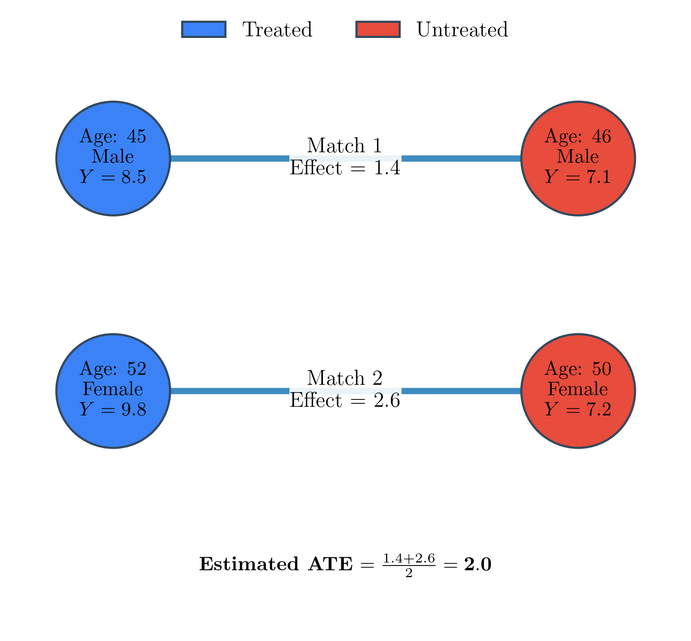

---
title: Matching Methods
sidebar:
  order: 3
---
import Callout from '@components/Callout.astro';

## The Core Mechanism

Matching constructs a counterfactual by pairing each treated patient with the most similar untreated patient based on observed characteristics (covariates) $X$. The [Average Treatment Effect](/tracks/causal-inference/fundamental-assumptions/) (ATE) is then simply the average difference in outcomes across all these matched pairs.

## Greedy Matching

To quantify similarity mathematically, we use a distance metric. The **Mahalanobis distance** is the most common choice in causal inference because it accounts for the covariance between different features, ensuring that highly correlated variables do not disproportionately dominate the distance calculation. 

<Callout type="note" title="Exploration: Mahalanobis vs. Euclidean Distance" collapsible defaultOpen={false}>
*Assumes two covariates: Weight (kg) and BMI, which are highly positively correlated.*

If we use Euclidean distance, a difference of 1 unit in BMI is treated the same as a difference of 1 unit in Weight. Since Weight and BMI move together, a patient who is heavier will also have a higher BMI. Euclidean distance double-counts this single underlying physical difference. 

The Mahalanobis distance includes the inverse covariance matrix $S^{-1}$:

$$
d(i, j) = \sqrt{(X_i - X_j)^\top S^{-1} (X_i - X_j)}
$$

By multiplying by $S^{-1}$, Mahalanobis distance "decorrelates" the variables and scales them by their variance. This ensures that the redundancy between Weight and BMI is factored out, providing a truer measure of patient similarity.
</Callout>

The standard greedy matching algorithm pairs patients sequentially:
- Randomly order the treated patients.
- For the first treated patient, calculate the distance to all available untreated patients.
- Pair the treated patient with the untreated patient who has the smallest distance.
- Remove the matched untreated patient from the available pool (matching without replacement).
- Repeat for the next treated patient until all treated patients are matched.

<Callout type="note" title="Worked Example: Greedy Matching" collapsible defaultOpen={false}>
*Assumes Euclidean distance for simplicity, 1-to-1 matching without replacement. Age and BP are unscaled.*

| Patient | Group | Age | BP | Outcome $Y$ |
|---------|-------|-----|-----|-------------|
| 1 | Treated | 45 | 120 | 8.5 |
| 2 | Treated | 52 | 135 | 9.8 |
| 3 | Untreated | 46 | 118 | 7.1 |
| 4 | Untreated | 50 | 130 | 7.2 |
| 5 | Untreated | 55 | 140 | 8.0 |

**Step 1: Match Treated Patient 1 (Age 45, BP 120)**
- To Patient 3: $d(1,3) = \sqrt{1^2 + 2^2} \approx 2.24$ (Nearest)
- To Patient 4: $d(1,4) = \sqrt{5^2 + 10^2} \approx 11.18$
- To Patient 5: $d(1,5) = \sqrt{10^2 + 20^2} \approx 22.36$
*Match: (1, 3). Effect:* $8.5 - 7.1 = 1.4$.

**Step 2: Match Treated Patient 2 (Age 52, BP 135)**
- To Patient 4: $d(2,4) = \sqrt{2^2 + 5^2} \approx 5.39$ (Nearest of remaining)
- To Patient 5: $d(2,5) = \sqrt{3^2 + 5^2} \approx 5.83$
*Match: (2, 4). Effect:* $9.8 - 7.2 = 2.6$.

**Step 3: Estimate ATE**
Average the pairwise effects over $M$ matched pairs:

$$
\widehat{\text{ATE}} = \frac{1}{M} \sum_{m=1}^M \left(Y_{\text{treat},m} - Y_{\text{control},m}\right)
$$

Here, $\widehat{\text{ATE}} = \frac{1.4 + 2.6}{2} = 2.0$.
</Callout>

### Global Matching

The greedy approach pairs patients sequentially, which is fast but suboptimal because an early match might steal the best match for a subsequent patient. Global matching algorithms solve this by optimizing all pairs at once:

- **Optimal Matching**: Minimizes the total, global distance across all matched pairs simultaneously using network flow algorithms. It yields better overall matches but is computationally expensive for large datasets.
- **Full Matching**: Instead of strict 1-to-1 pairing, it creates subclasses containing at least one treated and one control patient, minimizing the average distance within subclasses. This uses all available data and often achieves better balance.

### Calipers

Because greedy matching forces a pair for every treated patient, the last few treated patients may be paired with completely dissimilar controls simply because all the good matches were taken. 

A **caliper** sets a maximum allowable distance $c$. The matching process becomes:
1. Find the nearest untreated patient.
2. Check if $d(i,j) \le c$. 
3. If yes, make the match. If no, discard the treated patient entirely.

<Callout type="note" title="Exploration: The Need for Calipers" collapsible defaultOpen={false}>
Imagine we have 10 treated patients and 10 untreated patients. The first 9 treated patients find excellent, highly similar matches. 

However, the 10th treated patient is a 30-year-old female, and the only remaining untreated patient is an 85-year-old male. Greedy matching will automatically pair them together because he is the "nearest" (and only) option left. Comparing their outcomes will severely bias the analysis. A caliper prevents this by rejecting the match and dropping the 30-year-old treated patient, preserving the internal validity of our comparison (though changing our population scope).
</Callout>

## Balance Diagnostics

After matching, we must verify that our new pseudo-population has achieved identical baseline distributions across the treatment and control groups.

1. **Standardized Mean Difference (SMD)**: Measures the difference in means for each covariate, scaled by their pooled standard deviation.

$$
\text{SMD}_k = \frac{\bar{X}_k^{\text{treat}} - \bar{X}_k^{\text{control}}}{\sqrt{(s_k^{\text{treat}})^2 + (s_k^{\text{control}})^2}/2}
$$

   A standard threshold is $\text{SMD}_k < 0.1$. Larger differences indicate that the matching failed to eliminate residual confounding.
2. **Variance Ratio**: Checks if the spread of the covariate is similar in both groups. A ratio near 1.0 is ideal; ratios outside $[0.8, 1.25]$ suggest poor balance in the tails of the distribution.
3. **Empirical CDFs (eCDF)**: Visual inspection of the cumulative distribution functions for continuous covariates ensures that the entire distribution (not just the mean and variance) is balanced.

## Limitations

Direct covariate matching has significant practical flaws:

- **Curse of Dimensionality**: As the number of patient characteristics grows, finding exact or even close matches becomes geometrically impossible. The data becomes sparse, and distances between patients become uniformly large.
- **Arbitrary Feature Importance**: In standard matching distance metrics, all covariates are treated equally. However, some characteristics might heavily drive treatment assignment or outcome (e.g., age), while others have zero impact (e.g., eye color). Simple matching expends just as much effort balancing irrelevant variables as critical ones.

Because of these limitations, **[Propensity Scores](/tracks/causal-inference/propensity-scores/)** emerge as a powerful solution. By mathematically projecting all covariates into a single scalar probability, we can compress the multi-dimensional balancing problem into a 1D space, cleanly sidestepping the curse of dimensionality and automatically weighting covariates by their actual importance to the treatment assignment.

---

