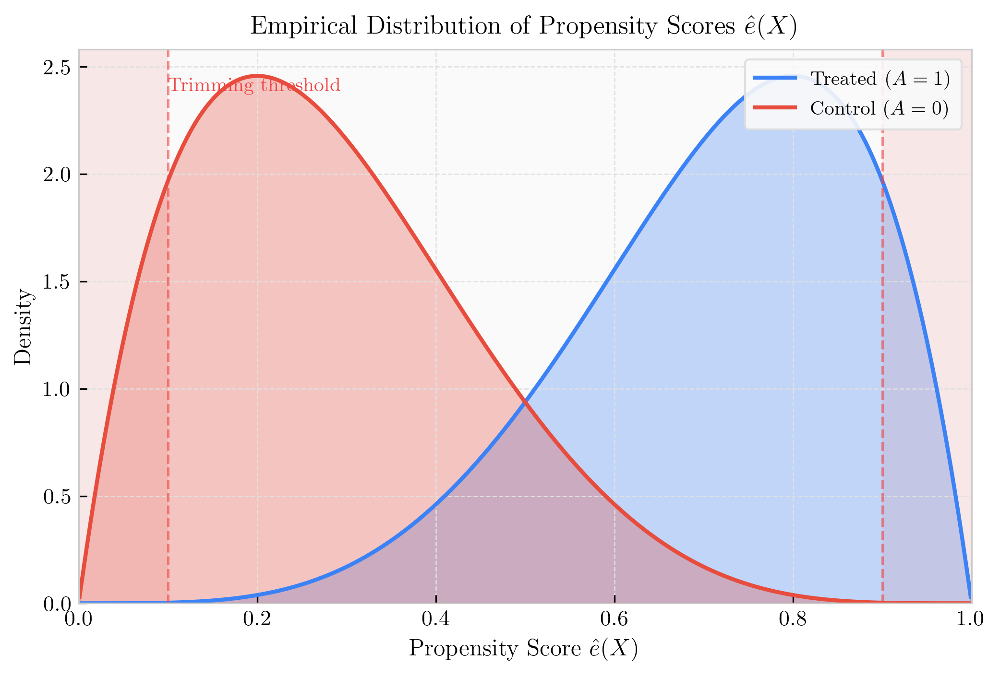

---
title: Propensity Scores
sidebar:
  order: 4
---
import Callout from '@components/Callout.astro';

## The Propensity Score Theorem

The **propensity score** is the probability of receiving treatment given observed covariates (patient characteristics):

$$
e(X) = P(A = 1 \mid X)
$$

For example, if we are evaluating the effect of antibiotics, an immunosuppressed patient is clinically much more likely to be prescribed antibiotics than a healthy patient. Therefore, their propensity score for receiving the treatment is significantly higher.

Rosenbaum and Rubin (1983) proved that if treatment assignment is [ignorable](/tracks/causal-inference/fundamental-assumptions/) given $X$, then it is also ignorable given the single, scalar propensity score $e(X)$:

$$
Y_1, Y_0 \perp A \mid X \quad \Rightarrow \quad Y_1, Y_0 \perp A \mid e(X)
$$

<Callout type="note" title="Derivation: Ignorability given the Propensity Score" collapsible defaultOpen={false}>
We want to show that $P(A=1 \mid Y_1, Y_0, e(X)) = P(A=1 \mid e(X))$.

By the law of total probability, conditioning on the full covariates $X$:

$$
P(A=1 \mid Y_1, Y_0, e(X)) = \mathbb{E}_X [P(A=1 \mid Y_1, Y_0, X) \mid Y_1, Y_0, e(X)]
$$

By standard ignorability ($Y_1, Y_0 \perp A \mid X$), the treatment $A$ is independent of potential outcomes given $X$:

$$
P(A=1 \mid Y_1, Y_0, X) = P(A=1 \mid X)
$$

By definition, $P(A=1 \mid X) = e(X)$. Substituting this back into the expectation:

$$
= \mathbb{E}_X [e(X) \mid Y_1, Y_0, e(X)]
$$

Since we are conditioning on $e(X)$, the expectation of $e(X)$ is simply $e(X)$ itself:

$$
= e(X)
$$

Since $e(X) = P(A=1 \mid e(X))$, we conclude that $P(A=1 \mid Y_1, Y_0, e(X)) = P(A=1 \mid e(X))$, proving that $Y_1, Y_0 \perp A \mid e(X)$.
</Callout>

This dimensionality reduction is extremely powerful. Instead of trying to find exact matches for every single patient characteristic (which becomes impossible with many variables—the "curse of dimensionality"), we only need to adjust for this single probability score. Crucially, matching patients on $e(X)$ balances their covariates *on average* across the treated and control groups, even if any two matched patients differ significantly in their specific $X$ values.

<Callout type="note" title="Worked Example: Balance on Average" collapsible defaultOpen={false}>
Consider two covariates: Age and Blood Pressure (BP). 

Two distinct patients might share the exact same propensity score $e(X) = 0.6$:
- **Patient A (Treated)**: 60 years old, normal BP.
- **Patient B (Control)**: 30 years old, extremely high BP.

If we pair them, the match is terrible on an *individual* level (Age and BP are wildly different). However, Propensity Score Matching guarantees **expectation balance**: $\mathbb{E}[X \mid A=1, e(X)] = \mathbb{E}[X \mid A=0, e(X)]$. 

If we match 100 treated patients with $e(X) = 0.6$ to 100 control patients with $e(X) = 0.6$, the *average* Age and *average* BP across all 100 treated patients will perfectly match the averages across the 100 control patients. As long as the outcome model relies on these averages (as the ATE does), individual imbalance cancels out, and confounding is successfully removed at the population level.
</Callout>

## Estimation and Calibration

$e(X)$ is estimated by regressing treatment $A$ on covariates $X$.

Logistic regression is the standard choice:

$$
\log\left(\frac{e(X)}{1 - e(X)}\right) = \beta_0 + \beta^\top X
$$

Logistic regression yields well-calibrated probabilities natively. Highly flexible machine learning models (like gradient boosted trees) can minimize classification error, but they often "over-segregate" patients, producing extreme scores near 0 or 1. This violates the [positivity](/tracks/causal-inference/fundamental-assumptions/) assumption (we need some uncertainty in who gets treated to make comparisons). If non-linear models are used, their outputs must be explicitly calibrated (e.g., via Platt scaling) to represent true probabilities rather than mere rankings.

## Diagnostics and Overlap

The [positivity](/tracks/causal-inference/fundamental-assumptions/) assumption requires $0 < e(X) < 1$. To diagnose overlap, plot the empirical distribution of $\hat{e}(X)$ separately for the treated and control groups.

If distributions do not overlap sufficiently:
- **Trimming**: Drop patients with extreme scores (e.g., $\hat{e}(X) < 0.1$ or $> 0.9$).
- **Truncation**: Cap scores at bounds to control variance.

Both methods trade bias for variance and change the question we are answering: they estimate the causal effect only for the specific subpopulation where overlap exists, no longer the global Average Treatment Effect (ATE).

## Usage Strategies

The estimated propensity score $\hat{e}(X)$ serves as the foundation for several causal estimators:

- **[Propensity Score Matching](/tracks/causal-inference/matching-methods/)**: Pair treated and control patients who share the closest $\hat{e}(X)$. This suffers less from the curse of dimensionality than exact covariate matching.
- **Stratification**: Divide the sample into quantiles (e.g., quintiles) of $\hat{e}(X)$. Estimate the ATE within each subgroup and average them. This avoids discarding unmatched patients.
- **[Propensity Score Weighting](/tracks/causal-inference/inverse-probability-weighting/)**: Use $1/\hat{e}(X)$ to weight observations, mathematically "cloning" underrepresented patients to create a pseudo-population where treatment is unconfounded.

---

