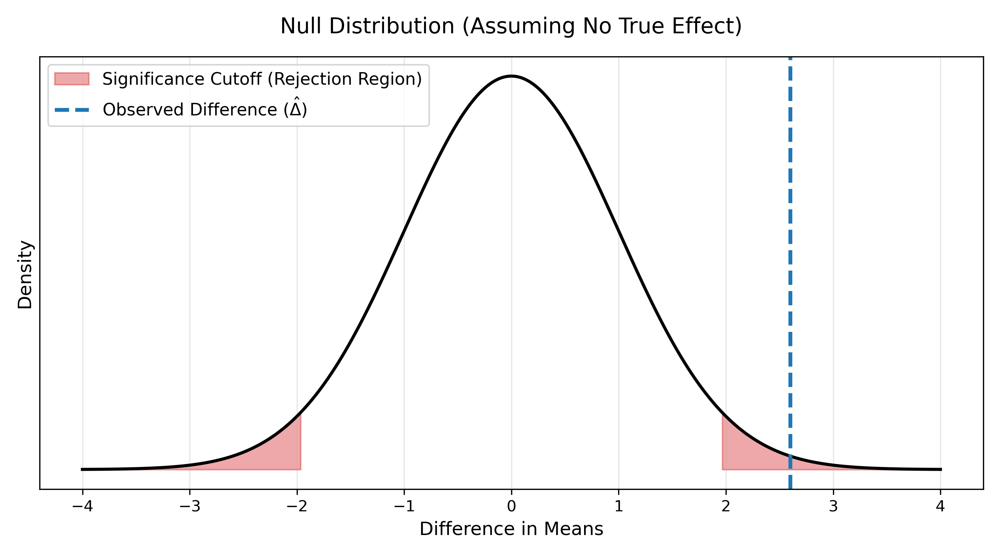

---
title: Foundations of A/B Testing
sidebar:
  order: 1
---

import Callout from '@components/Callout.astro';

The goal of an experiment is to determine whether a new treatment is effective. Ideally, we would want to check for each user whether their target metric (e.g., revenue) is higher under the treatment than under the control.

However, we cannot observe how the exact same user reacts to two different states simultaneously. They can only be exposed to one state at a time.

Instead, we randomize the treatment across a large sample, which controls for possible confounders. We then calculate an estimator that quantifies the effectiveness of the treatment: the **Average Treatment Effect (ATE)**.

$$
\text{ATE} = \mathbb{E}[Y_T - Y_C]
$$

<Callout type="info" title="Derivation: Linearity of Expectation" collapsible defaultOpen={false}>

By the linearity of expectation, the expected value of the difference is simply the difference of the expected values:

$$
\mathbb{E}[Y_T - Y_C] = \mathbb{E}[Y_T] - \mathbb{E}[Y_C]
$$

This means the ATE is equivalent to the expected treatment outcome minus the expected control outcome.

</Callout>

## Uncertainty Quantification

We can estimate the magnitude of the effect by calculating the simple difference in means. However, to ensure this difference is stable and not merely a product of random chance, we must understand how this difference is distributed.

### Central Limit Theorem

According to the Central Limit Theorem, for a large enough sample of data, the sample mean is normally distributed.

While the exact mechanics are covered in the dedicated note, the high-level concept is that for a sufficiently large sample, both the treatment mean and the control mean follow a normal distribution. A normal distribution is parameterized by a mean ($\mu$) and a variance ($\sigma^2$), denoted as $\mathcal{N}(\mu, \sigma^2)$.

### Raw Observations vs. Sample Means

The raw individual observations (e.g., each user's revenue) are distinct from the final average across them. We are interested in modeling the dispersion of the *average*, not of the raw values.

The expected value of the sample mean is simply the population mean:

$$
\mathbb{E}[\bar{X}] = \mu
$$

However, the variance of the sample mean scales down as the sample size grows.

<Callout type="info" title="Derivation: Variance of the Sample Mean" collapsible defaultOpen={false}>

Assuming independent and identically distributed (i.i.d.) observations, the variance of the sample mean $\bar{X}$ is:

$$
\text{Var}(\bar{X}) = \text{Var}\left( \frac{1}{n} \sum_{i=1}^{n} X_i \right)
$$

Pulling the constant $\frac{1}{n}$ out of the variance squares it:

$$
= \frac{1}{n^2} \sum_{i=1}^{n} \text{Var}(X_i)
$$

Since each observation has variance $\sigma^2$, the sum is $n\sigma^2$:

$$
= \frac{n\sigma^2}{n^2} = \frac{\sigma^2}{n}
$$

</Callout>

This $1/n$ scaling gives us the final normal distributions for each of the sample means:
- **Treatment Mean**: $\bar{X}_T \sim \mathcal{N}\left(\mu_T, \frac{\sigma_T^2}{n_T}\right)$
- **Control Mean**: $\bar{X}_C \sim \mathcal{N}\left(\mu_C, \frac{\sigma_C^2}{n_C}\right)$

### The Difference-in-Means Estimator

The estimator we want is the Average Treatment Effect, which is the difference between these two sample means.

A fundamental property of normal distributions is that the difference between two independent normal distributions is itself a normal distribution. When we subtract the control distribution from the treatment distribution:
1. **The means subtract**: The new mean is $\mu_T - \mu_C$.
2. **The variances add**: The new variance is $\frac{\sigma_T^2}{n_T} + \frac{\sigma_C^2}{n_C}$. Subtracting two uncertain variables strictly increases the total uncertainty.

This yields the final parameterized normal distribution for our Difference-in-Means estimator ($\hat{\Delta}$):

$$
\hat{\Delta} \sim \mathcal{N}\left(\mu_T - \mu_C, \frac{\sigma_T^2}{n_T} + \frac{\sigma_C^2}{n_C}\right)
$$

### Uncertainty Quantification

We run an experiment, gather the data, and follow the steps above to calculate the variance of our estimator.

To quantify uncertainty, we plot a normal distribution under the null hypothesis (assuming the treatment has zero effect). This null distribution is artificially centered at 0, but it is parameterized by the exact variance we calculated from our experiment.

We then take our actual observed difference in means ($\hat{\Delta}$) and check where it sits on this curve.

If our observed value falls beyond the significance cutoff, it is highly unlikely that this difference occurred by chance under the null distribution. This process of evaluating the observed statistic against the null distribution is the core of uncertainty quantification.

## Setup Parameters

So far, we have operated in abstract terms using general variance ($\sigma^2$) and mean ($\mu$) notation. In practice, we must define how to calculate this variance based on the underlying data.

The expected value remains the sample average, but the variance calculation depends entirely on the target metric:

- **Continuous Metrics** (e.g., Revenue per User, Time Spent): The variance is calculated using the standard sample variance formula, which measures the squared deviations from the mean:

$$
s^2 = \frac{1}{n-1} \sum_{i=1}^{n} (X_i - \bar{X})^2
$$

- **Binary Metrics** (e.g., Conversion Rate, Click-Through Rate): These follow a Bernoulli distribution. The variance is deterministically linked to the success proportion ($\hat{p}$):

$$
s^2 = \hat{p}(1 - \hat{p})
$$

<Callout type="note" title="Data-Driven Variance">

We use the actual experimental data to calculate the sample variance ($s^2$) according to the formulas above. These values are then plugged in for the general variance notation ($\sigma^2$) and automatically scaled by $1/n$ to represent the sample mean's variance.

</Callout>

## The Map of the Territory

The framework outlined above assumes optimal conditions. In reality, A/B testing frequently encounters edge cases and assumption violations. The remaining notes in this track detail how to handle these breakdowns:

- **[Power & Sensitivity](/tracks/experimentation/frequentist-experimentation/power-and-sensitivity/)**: How to size experiments to reliably detect real effects, including CUPED variance reduction.
- **[Multiple Testing](/tracks/experimentation/frequentist-experimentation/multiple-testing/)**: How the false positive rate inflates when evaluating multiple metrics or variants simultaneously, and how to correct for it.
- **[Repeated Looks and Peeking](/tracks/experimentation/frequentist-experimentation/repeated-looks-and-peeking/)**: The statistical dangers of continuously monitoring experiments and stopping early.
- **[Normality & Resampling](/tracks/experimentation/frequentist-experimentation/normality-and-resampling/)**: Alternative approaches for when the Central Limit Theorem breaks down due to extreme outliers or non-mean metrics.
- **[Interaction Effects](/tracks/experimentation/frequentist-experimentation/interaction-effects/)**: Methods for detecting and mitigating interference when multiple experiments run concurrently.
- **[Spillover and Network Effects](/tracks/experimentation/frequentist-experimentation/spillover-and-network-effects/)**: How to handle violations of the independence assumption when treating one user affects the control group.

