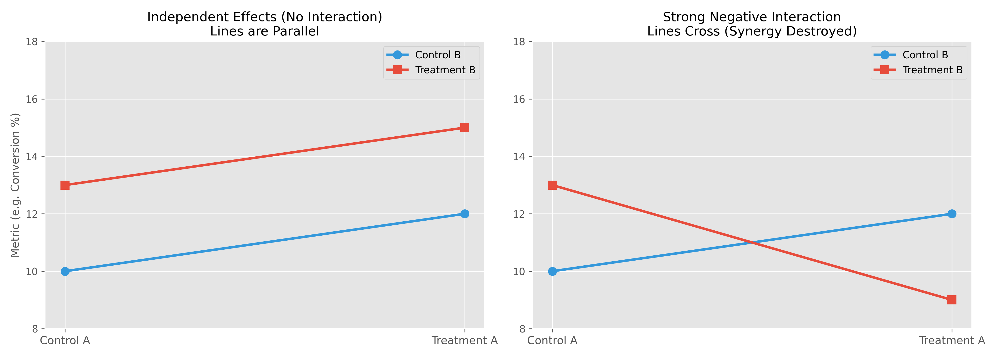
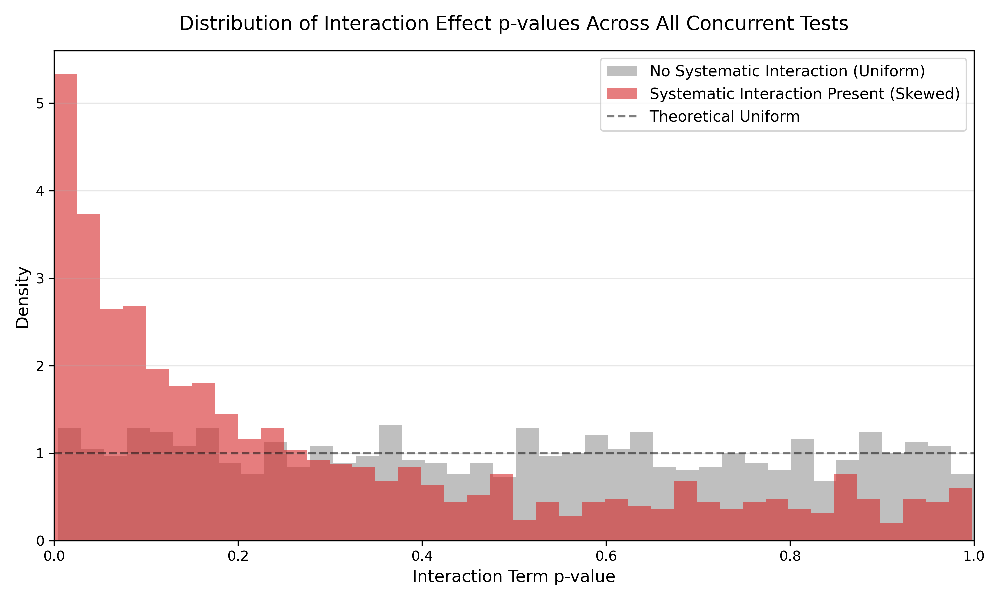

import Callout from '../../../../../components/Callout.astro';

While [Spillover and Network Effects](/tracks/experimentation/frequentist-experimentation/spillover-and-network-effects/) deal with interference between *users*, **Interaction Effects** deal with interference between *experiments*.

In mature tech companies, dozens of product teams run A/B tests simultaneously. We typically rely on the **Orthogonality Assumption**: the belief that if a user is exposed to Team A's test and Team B's test, the effects are completely independent and strictly additive.

When this assumption fails, an Interaction Effect occurs.

<Callout type="example" title="The Broken Carousel" collapsible defaultOpen={false}>

- **Scenario**: Team A (Backend) deploys a Recommendation Model surfacing obscure products. Team B (Frontend) deploys a UI carousel highlighting high-resolution images of mainstream products.
- **The Interaction**: Team A's model works great with the old UI. Team B's UI works great with the old model. But if a user gets *both*, the new UI tries to highlight obscure products lacking high-res images. The page breaks, and conversion crashes.
- **The Result**: Both teams see terrible metrics on their independent dashboards and conclude their feature failed, missing that the *combination* caused the drop.

</Callout>

## Detecting Interaction Effects

### The Data Structure

Before detecting interactions, we must structure our data. Suppose we have two concurrent experiments: A and B. Each has a control group ($A_0, B_0$) and a treatment group ($A_1, B_1$).

Because users are randomly assigned to both independently, they fall into one of four combinations:

| | $B_0$ | $B_1$ |
|---|---|---|
| **$A_0$** | $A_0 B_0$ | $A_0 B_1$ |
| **$A_1$** | $A_1 B_0$ | $A_1 B_1$ |

At the user level, the data looks like this:

| User | $Y$ (Target Metric) | $A$ | $B$ |
| --- | --- | --- | --- |
| 1 | 12.50 | 0 | 0 |
| 2 | 0.00 | 1 | 0 |
| 3 | 45.20 | 0 | 1 |
| 4 | 9.99 | 1 | 1 |
| 5 | 0.00 | 1 | 1 |

### Continuous Metrics

To detect interaction effects on a continuous target metric (e.g., Revenue per User), we use a multiple linear regression approach (Two-Way ANOVA). We fit the following model to our user-level data:

$$
Y = \beta_0 + \beta_1 A + \beta_2 B + \beta_3 (A \times B) + \epsilon
$$

<Callout type="info" title="Equation Terms">

- **$\beta_0$**: Baseline metric for the $A_0 B_0$ group.
- **$\beta_1, \beta_2$**: Independent main effects of treatments A and B.
- **$\beta_3$**: The interaction term. It captures the *additional* effect of having both treatments active simultaneously.

</Callout>

To detect an interaction, we check the significance of the $\beta_3$ coefficient using the regression's standard t-test. If $\beta_3$ is statistically significant ($p < 0.05$), an interaction is present. We then look at its magnitude to decide if it is practically meaningful.

Visually, we can display interaction effects by plotting the expected value of our metric across the different groups.

- **Left Plot (No Interaction):** If the treatments are perfectly independent, the lines are perfectly parallel. The jump from $B_0$ to $B_1$ is identical regardless of whether the user is in $A_0$ or $A_1$.
- **Right Plot (Interaction Present):** If an interaction effect exists, the lines are non-parallel. In this specific example, the lines cross, indicating the interaction is severe enough to actually reverse the direction of the main effect depending on the presence of the other feature.

### Binary and Categorical Metrics

If the target metric is binary (e.g., Conversion Rate, Click-Through Rate), linear regression is inappropriate because it can predict probabilities outside the bounds of 0 and 1. We have two primary alternatives.

#### Logistic Regression

The most direct adaptation is to use Logistic Regression. We use the exact same equation structure as the continuous case, but wrap it in a logit link function:

$$
\ln\left(\frac{p}{1-p}\right) = \beta_0 + \beta_1 A + \beta_2 B + \beta_3 (A \times B)
$$

We still look at the significance of the $\beta_3$ coefficient using the model's standard z-test or Wald test. If $\beta_3$ is significant, an interaction exists.

<Callout type="warning" title="Multiplicative, Not Additive">

Because logistic regression operates on log-odds, the interaction effect here is **multiplicative**, not additive. A significant $\beta_3$ means that the *odds ratio* of Treatment A changes depending on the presence of Treatment B.

</Callout>

#### Chi-Square Testing

Instead of fitting a regression model, we can use a purely categorical approach based on the Breslow-Day test for homogeneity of odds ratios.

**Procedure:**
1. Split the data into two $2 \times 2$ contingency tables based on Experiment B:

**Table 1: Users in $B_0$**

| | Not Converted | Converted |
| --- | --- | --- |
| **$A_0$** | Count | Count |
| **$A_1$** | Count | Count |

**Table 2: Users in $B_1$**

| | Not Converted | Converted |
|---|---|---|
| **$A_0$** | Count | Count |
| **$A_1$** | Count | Count |

2. Calculate the Odds Ratio (OR) of Treatment A for both tables.
3. Use a Chi-Square test statistic to evaluate if the difference between these two odds ratios is statistically significant.
4. If $p < 0.05$, we reject the null hypothesis of homogeneous odds ratios, concluding an interaction effect is present.

Unlike logistic regression, which fits a unified model to predict individual user probabilities, the Chi-Square approach relies entirely on aggregated group counts and directly compares the effect sizes across strata.

<Callout type="example" title="Worked Example: Chi-Square Interaction" collapsible defaultOpen={false}>

Suppose we test a new Checkout Button ($A$) and a new Cart Layout ($B$) on 4,000 users (1,000 per bucket). Our target metric is Conversion.

**Step 1: Table for $B_0$ (Old Cart)**

| | Did Not Convert | Converted |
|---|---|---|
| **$A_0$ (Old Button)** | 900 | 100 (10%) |
| **$A_1$ (New Button)** | 850 | 150 (15%) |

The Odds Ratio for the new button under the old cart is:

$$
OR_{B0} = \frac{150 / 850}{100 / 900} = 1.58
$$

**Step 2: Table for $B_1$ (New Cart)**

| | Did Not Convert | Converted |
|---|---|---|
| **$A_0$ (Old Button)** | 900 | 100 (10%) |
| **$A_1$ (New Button)** | 950 | 50 (5%) |

The Odds Ratio for the new button under the new cart is:

$$
OR_{B1} = \frac{50 / 950}{100 / 900} = 0.47
$$

**Step 3 & 4: Significance**
The new button increases conversions by 50% in the old cart, but *halves* conversions in the new cart. To prove this interaction is statistically significant, we calculate the standard error of the log odds ratios and compute the test statistic.

The difference in log odds is $\ln(1.58) - \ln(0.47) = 1.212$.
The pooled standard error across all cells is $0.225$.
Our Z-score is $1.212 / 0.225 = 5.38$, which squares to a $\chi^2$ statistic of $28.9$.

The p-value for $\chi^2 = 28.9$ with 1 degree of freedom is $< 0.0001$. We have definitively detected a severe interaction effect.

</Callout>

## Systematic Interaction Effects

Beyond individual experiment pairs, companies often want to measure **systematic effects**: *Overall, do we have above-random interaction effects across all our concurrent tests?*

**Procedure:**
1. Run the interaction effect detection procedures (ANOVA or Chi-Square) for every pairwise combination of concurrent tests over a historical period.
2. Extract the p-value of the interaction coefficient ($\beta_3$) for each pair.
3. Plot the distribution of these p-values.

If tests are truly independent, the interaction p-values will be uniformly distributed between 0 and 1. Any deviation from uniformity—specifically, a skew towards 0—proves the presence of systematic interaction effects.

If the historical distribution matches the red skewed curve, the platform has a systemic interference problem and must exercise caution when running concurrent tests.

<Callout type="note" title="Practical Reality of Interactions">

Most companies don't tend to care about interaction effects, and it is rare in practice to observe systematic interaction effects at scale.

If interaction effects *are* systematically present, companies should:
- **Inspect the root cause:** The interaction may actually be an error in the A/B testing pipeline, an error in randomization (e.g., hash collisions), or a bug in the interaction analysis pipeline itself.
- **Create Gated Zones:** Identify areas where interactions are likely. In these zones, either run tests sequentially, or run them concurrently but *always* run an interaction effect post-analysis on each experiment to confirm there were none. All other non-gated zones can keep operating normally and concurrently without issue.

</Callout>

---
