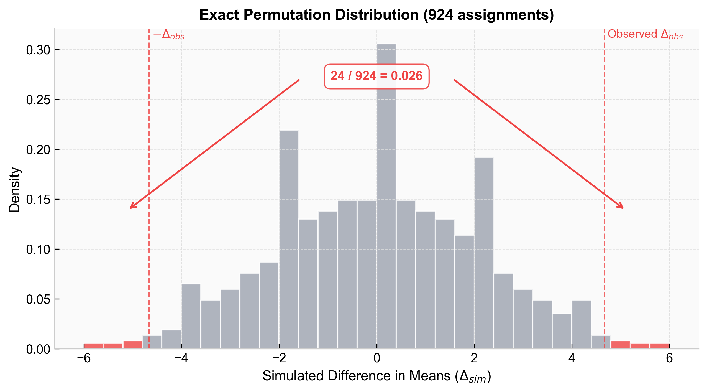

import Callout from '../../../../../components/Callout.astro';

Our core testing framework assumes a normally distributed mean for our test metric. Thanks to the Central Limit Theorem, this holds true even if the underlying data distribution is not normal. However, when the CLT breaks down, we need alternative approaches to inference.

## Failure Modes of the Central Limit Theorem

The CLT fails to provide a reliable normal approximation in two main scenarios:

- **Not enough data:** The CLT holds asymptotically. High skewness or large outliers require significantly larger sample sizes before the sampling distribution normalizes.
- **Non-mean metrics:** The CLT only applies to sample means. If the metric is a median, a specific quantile, or variance, the CLT offers no guarantees.

When faced with these breaches, we either transform the values or simulate the null distribution directly via resampling.

## Log Transformations

For heavily right-skewed positive data, a **Log Transformation** compresses the long tail:

$$X_i^* = \log(X_i + 1)$$

Where $X_i$ is the original metric value for user $i$. This stabilizes variance driven by extreme values, but fundamentally changes the hypothesis. It shifts the analysis from absolute units to percentage changes (or geometric means).

## Resampling Methods

When transforming the metric changes the business question too much, resampling keeps the observed values intact and uses computation to approximate the sampling behavior.

### Permutation Testing

Permutation testing asks: *What treatment effects would appear if the treatment labels were meaningless?*

Under the **sharp null hypothesis**, the treatment changes nobody's outcome. If true, any observed value could have received either label. We can repeatedly reshuffle labels and recompute the test statistic to build the null distribution from scratch.

**Procedure**
1. Compute the observed statistic, $\Delta_{obs} = \bar{X}_T - \bar{X}_C$.
2. Pool the outcomes from both groups.
3. Reassign treatment/control labels in every possible way (or randomly sample for large data).
4. Recompute the simulated difference ($\Delta_{sim}$) after each reassignment.
5. Compare $\Delta_{obs}$ to this permutation distribution.

<Callout type="example" title="Worked Example" collapsible defaultOpen={false}>

Suppose we observe 12 users, 6 per group:

| Group | Values | Mean |
| :--- | :--- | :--- |
| Treatment | 9, 10, 11, 12, 14, 15 | 11.83 |
| Control | 4, 5, 6, 7, 8, 13 | 7.17 |

Observed difference: $\Delta_{obs} = 11.83 - 7.17 = 4.67$

**Simulate one permutation:**
Pool all 12 values: `[4, 5, 6, 7, 8, 9, 10, 11, 12, 13, 14, 15]`.
Blindly pull 6 random values for "Treatment", the rest for "Control":

| Group | Randomly Assigned Values | Mean |
| :--- | :--- | :--- |
| Treatment | 4, 6, 9, 11, 12, 15 | 9.50 |
| Control | 5, 7, 8, 10, 13, 14 | 9.50 |

Simulated difference: $\Delta_{sim} = 9.50 - 9.50 = 0.00$

There are $\binom{12}{6} = 924$ possible assignments. Enumerating all 924 permutations gives the exact null distribution.

We check where our observed value ($\Delta_{obs} = 4.67$) sits on this histogram. Out of 924 permutations, exactly 24 produce a difference $\ge 4.67$ or $\le -4.67$.

The p-value is $24 / 924 = 0.026$. Since this is $< 0.05$, the result is statistically significant.

</Callout>

### Bootstrapping

While permutation testing shuffles labels to test the null hypothesis, Bootstrapping resamples the data *with replacement* to estimate the variance and confidence intervals of the estimator itself.

This is useful for non-mean metrics (like medians) or very small samples where the CLT fails.

<Callout type="warning" title="The Unit of Randomization Problem">

A failure mode appears when the **unit of analysis** is smaller than the **unit of randomization**. If users are randomized but page views are analyzed, page views from the same user are correlated. Standard bootstrapping breaks this dependency structure.

**Solution:** Use the **block bootstrap**. Resample whole users, not individual page views. If User A is drawn, all of User A's page views come with them, preserving the within-user dependency and ensuring accurate variance estimates.

</Callout>

---
