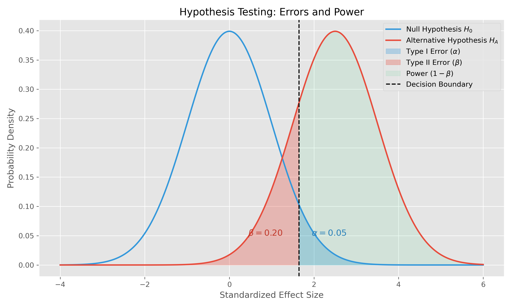
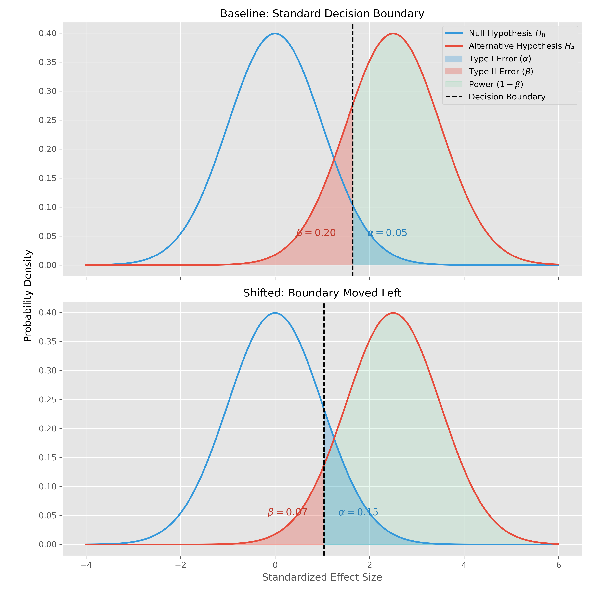
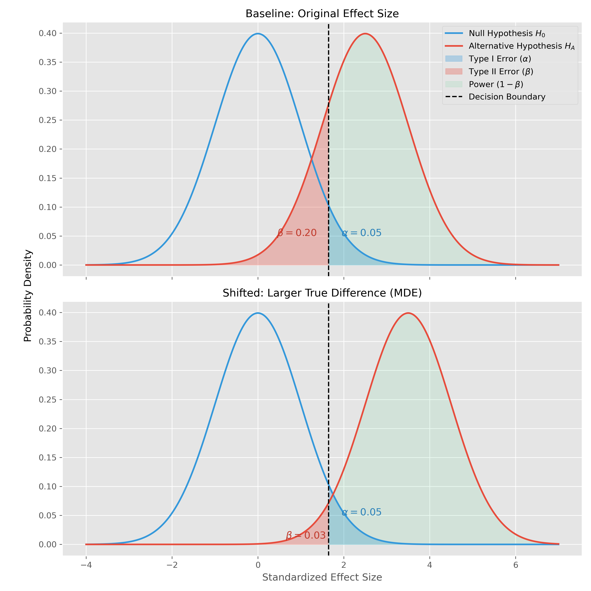
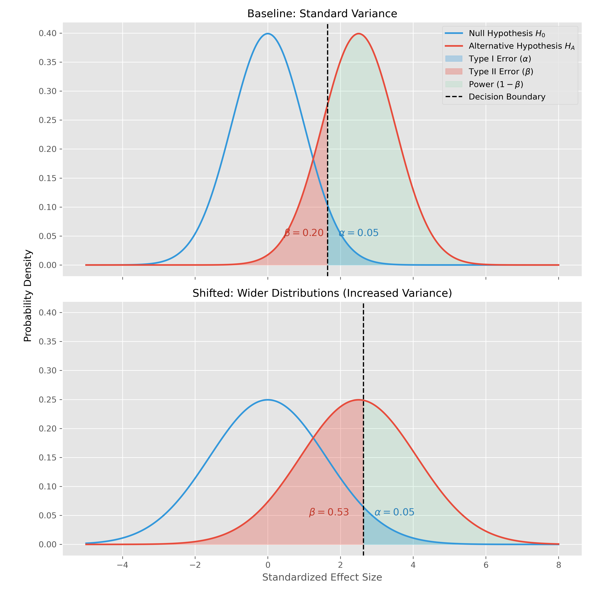
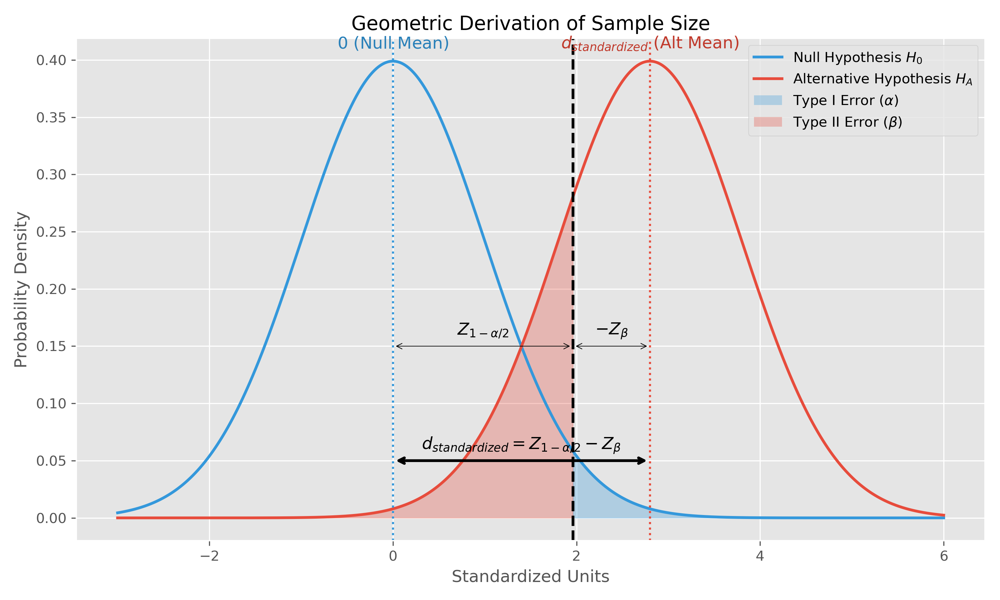

---
title: Power & Sensitivity
sidebar:
  order: 2
---

import Callout from '@components/Callout.astro';

Proper sizing ensures an experiment runs long enough to reliably detect real business impact, but not so long that it wastes traffic and delays critical product decisions.

## $\alpha$, $\beta$, and Power

In AB testing, we generally check whether some target metric differs between Treatment and Control groups. Formally, for some difference $\Delta = \mu_T - \mu_C$:

- **Null Hypothesis ($H_0$)**: $\Delta = 0$
- **Alternative Hypothesis ($H_A$)**: $\Delta \neq 0$

Whenever we make a binary hypothesis, we face:
1. **Type I Error ($\alpha$)**: Rejecting the null when it is true.
2. **Type II Error ($\beta$)**: Failing to reject the null when the alternative is true.

<Callout type="note" title="Power">

**Power** ($1 - \beta$) is the probability of correctly detecting a true effect.

</Callout>

<Callout type="example" title="Visualizing Type 1 and Type 2 Error" collapsible defaultOpen={false}>

Since $\Delta$ is a random variable, each hypothesis has its own distribution:

- Under $H_0$, the distribution is a standard normal centred at zero (the null assumes no difference between groups).
- Under $H_A$, it is shifted right by some non-zero difference $d$ (the alternative assumes some true difference between groups).

If we draw a vertical decision boundary:
- The blue area under $H_0$ is $\alpha$: the probability of falsely shipping a useless feature, if the null hypothesis is true.
- The red area under $H_A$ is $\beta$: the probability of failing to ship a genuinely useful feature, if the alternative hypothesis is true.

</Callout>

## The Three Levers of Power

The balance of $\alpha$ and $\beta$ can be analyzed geometrically. There are three main levers that affect it, broken down by section below.

### 1. The Decision Boundary

The first lever is the location of the decision boundary itself.

Moving the boundary changes the balance between Type I and Type II error:
- Moving the boundary left decreases $\beta$ but increases $\alpha$.
- Moving the boundary right decreases $\alpha$ but increases $\beta$.

<Callout type="note">

For a fixed pair of distributions, $\alpha$ and $\beta$ are inversely related. Reducing one necessarily increases the other.

</Callout>

### 2. The Hypothesized Difference

The second lever is the separation between the two distributions.

As the true difference $d$ increases:
- The distributions become more clearly separated.
- Without any increase in $\alpha$, we get a free reduction in $\beta$.

So we reduce Type II error without sacrificing any Type I error. Large effects are intuitively easier to detect.

<Callout type="note">

We do not actually control the true effect size. The value of $d$ is purely theoretical and depends entirely on whether a real treatment effect exists, and how large it is.

Later, we will use this assumed value purely as a constraint when deriving the required sample size for the experiment.

</Callout>

### 3. The Variance

The final lever is the variance of the distributions.

Increasing variance widens the distributions and increases their overlap (harder to tell apart, more $\beta$ for the same $\alpha$), and vice versa.

<Callout type="note">

The distributions above are normal distributions over $\Delta$, where:

$$
\Delta = \bar{X}_T - \bar{X}_C
$$

The variance of this estimator depends directly on sample size:

$$
\mathrm{Var}(\Delta) = \frac{2\sigma^2}{n}
$$

Increasing $n$ reduces variance, which tightens the distributions and decreases their overlap.

</Callout>

This is critical, as it finally gives us the first true variable lever among the three we described:
- We do not control the true value of $d$ (it depends on the true effect size).
- While we *can* choose the decision boundary, once it's chosen (to match our risk appetite for false positives vs. false negatives) it is fixed.

That leaves **variance**. And fortunately, variance can be influenced through the sample size $n$.

The idea then is, we fix:
- The desired $\alpha$ and $\beta$ balance.
- An assumed minimum effect size $d$ (we can't know it in advance, but we can say we want to be able to measure a difference of at least $d$ at the desired $\alpha$ and $\beta$ balance)

Then solve for the sample size required to make those constraints simultaneously true.

## Sample Size Derivation

<Callout type="note" title="The core question">

Given a desired $\alpha$, power, and MDE, how many observations do we need?

</Callout>

Place both hypotheses onto the same standardized normal axis. Under $H_0$, the distribution is centred at $0$. Somewhere along this axis, we choose an arbitrary decision boundary. The exact location does not matter; moving it left or right simply changes the tradeoff between $\alpha$ and $\beta$.

Now:
- For a two-sided test, the distance from the centre of the null distribution to this boundary is $Z_{1-\alpha/2}$.
- To achieve the desired power, the area of the alternative distribution falling below the decision boundary must equal $\beta$. From the alternative distribution's perspective, this boundary sits at the coordinate $Z_{\beta}$ (a negative value).

Since the boundary is the same point in space, we can equate the two coordinates:

$$
Z_{1-\alpha/2} = d_{standardized} + Z_{\beta}
$$

Solving for the total standardized separation between the two distributions' means gives:

$$
d_{standardized} = Z_{1-\alpha/2} - Z_{\beta}
$$

But this distance exists only in standardized Z-score units. To convert it back into real metric units, we multiply by the standard deviation of the estimator. Since:

$$
\mathrm{Var}(\Delta) = \frac{2\sigma^2}{n}
$$

the standard error becomes:

$$
\sqrt{\frac{2\sigma^2}{n}} = \sigma \sqrt{\frac{2}{n}}
$$

Applying this to the standardized separation equation gives the converted absolute unit distance:

$$
d = (Z_{1-\alpha/2} - Z_{\beta}) \cdot \sigma \sqrt{\frac{2}{n}}
$$

We now rearrange the equation to solve for sample size:

$$
n = \frac{2\sigma^2 (Z_{1-\alpha/2} - Z_{\beta})^2}{d^2}
$$

At this point, every term besides $n$ becomes a user input:
- $\alpha$ is fixed by our desired false positive rate.
- $\beta$ is fixed by our desired power.
- $d$ is fixed as our assumed minimum detectable effect.
- $\sigma^2$ is estimated from historical data (historical variance in the metric you're looking to target in the AB test).

Plug those in, and you have your target sample size!

## Variance Reduction (CUPED)

If traffic is limited and we cannot realistically reach the required sample size, the remaining option is to reduce variance directly.

**CUPED** (Controlled Experiments Using Pre-Experiment Data) exploits the fact that historical user behaviour is often highly predictive of future behaviour while remaining unaffected by treatment assignment.

Let:
- $Y$ be the in-experiment metric,
- $X$ be the same metric measured during a pre-experiment window.

We compute:

$$
\theta = \frac{\mathrm{Cov}(Y, X)}{\mathrm{Var}(X)}
$$

and define the adjusted metric:

$$
\hat{Y}_i = Y_i - \theta (X_i - \mathbb{E}[X])
$$

This removes the component of user behaviour already explained by historical baseline effects. The resulting variance becomes:

$$
\mathrm{Var}(\hat{Y}) = \mathrm{Var}(Y)(1-\rho^2)
$$

where $\rho$ is the correlation between pre-experiment and in-experiment behaviour.

If say $\rho = 0.8$, variance falls by $64\%$. Lower variance means lower sample size required to reach the same power (per previous power analysis derivations).

## Modern ML Extensions (CUPAC)

Classical CUPED uses a single linear covariate. **CUPAC** generalizes the same idea using Machine Learning.

Instead of adjusting against one historical metric, we train a predictive model on hundreds of pre-experiment features, estimate expected user behaviour, and run the experiment on the residual:

$$
Y_i - \hat{Y}_{ML, i}
$$

The better the model explains user behaviour, the smaller the remaining variance, and the fewer observations required to achieve the same statistical power.

---

