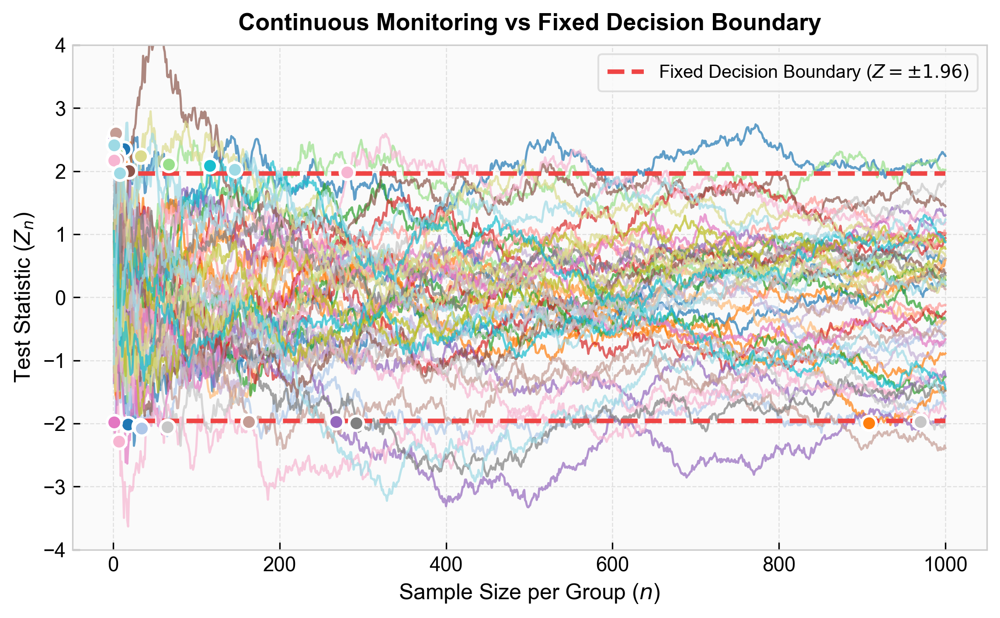
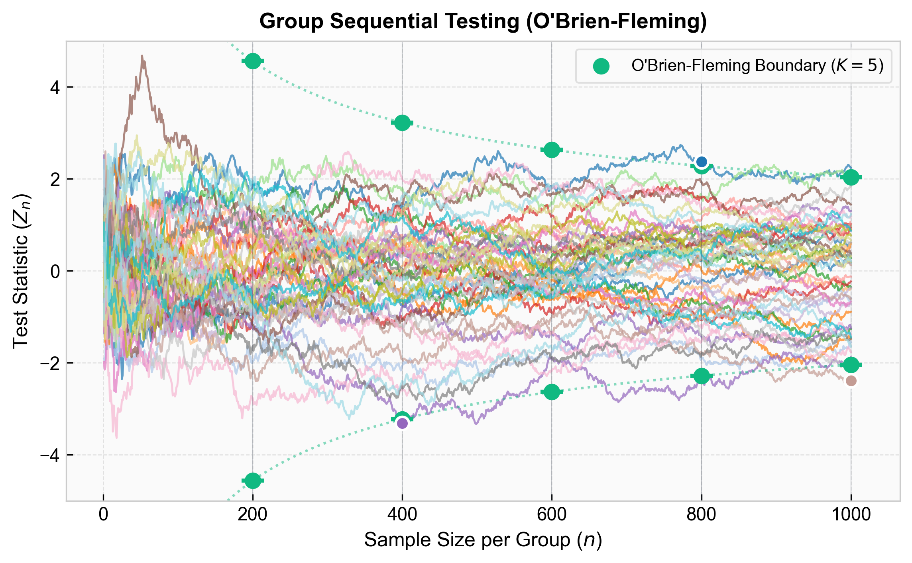

---
title: Repeated Looks and Peeking
sidebar:
  order: 4
---

import Callout from '@components/Callout.astro';

Continuously monitoring a dashboard and stopping an experiment the moment $p < 0.05$ is a temporal form of [Multiple Testing](/tracks/experimentation/frequentist-experimentation/multiple-testing/). You are running a new hypothesis test at every data increment.

<Callout type="note" title="Looking is Safe, Acting is Dangerous">

Crucially, **just looking at the data is not the problem**. The statistical error only occurs if you take action (stop early and declare a winner). If you wait for the predetermined sample size, your false positive rate remains 5%. If you stop early upon seeing significance, the false positive rate inflates dramatically.

</Callout>

Unlike independent multiple comparisons, the sequence of test statistics is highly autocorrelated. Because Day 6's data contains all of Day 5's data plus a small increment, we cannot use a clean Bonferroni correction or calculate an exact formula for how much the false positive rate inflates per peek. However, the inflation effect is still severe and unavoidable.

## Peeking Error Inflation

To see why peeking is dangerous, we simulate 50 A/B tests under the null hypothesis $H_0$ (no true effect), tracking the test statistic $Z_n$ (the Z-score calculated at sample size $n$) up to $n=1{,}000$ users per group.

| Metric | Value |
|---|---|
| Target False Positive Rate ($\alpha$) | 5.0% |
| Percentage of Anytime Positives | 54.0% |
| Percentage of End-of-Window Positives | 8.0% |

Each line is one simulated test. Despite no true effect, the paths wander widely and frequently cross the boundary. Variance accumulates over time, allowing the random walk to eventually hit the boundary given enough chances.

Calculating significance at any point inflates the false positive rate to 54% — a tenfold violation. By contrast, looking only at the end of the window ($n=1{,}000$) yields an 8% false positive rate (close to the expected 5%).

To fix this, we must either avoid acting on peeks, or change our statistical boundaries.

## Mitigations

### Fixed Horizon Testing

The simplest behavioral fix is strict adherence to a fixed sample size. Hide p-values until the predetermined $N$ is reached, or strictly commit to not stopping early.

<Callout type="note" title="The 'Do No Harm' Exception">

The only legitimate exception is a "Do No Harm" guardrail (e.g., a revenue crash). Technically, early significant negatives are just as statistically unreliable as early significant positives. However, due to prospect theory (losses hurt more than gains benefit), it makes business sense to be acutely tuned to the possibility of losses. While not statistically principled, it is a practical risk mitigation strategy.

</Callout>

### Multi-Armed Bandits

If the goal is *adaptive* allocation — routing traffic to the better variant quickly rather than cleanly measuring the effect — abandon fixed-horizon testing entirely. Use Multi-Armed Bandits, which are designed for this tradeoff.

### Group Sequential Testing

If we must peek but can restrict ourselves to a few planned interim looks (e.g., weekly check-ins), we use Group Sequential Testing. If we plan $K$ looks, we distribute our $\alpha$ budget across them via an **$\alpha$-spending function**.

The **O'Brien-Fleming (OBF)** boundary requires overwhelming evidence early on, relaxing the boundary as we gather data. It scales the threshold inversely with the square root of the information fraction $t_k = n_k / N$:

$$
Z_k = \frac{C_{OBF}}{\sqrt{t_k}}
$$

For $K=5$ looks at $\alpha=0.05$, $C_{OBF} \approx 2.040$. The boundary starts very wide and narrows to approximately $1.96$ at the final look.

| Metric | Value |
|---|---|
| Target False Positive Rate ($\alpha$) | 5.0% |
| Percentage of Anytime Positives | 6.0% |
| Percentage of End-of-Window Positives | 4.0% |

The wide early boundaries prevent spurious crossings. We **only** evaluate the test statistic at the 5 planned intervals. A path is only a false positive if it exceeds the boundary exactly at one of those look times.

<Callout type="warning" title="Limitations">

Group Sequential Testing is only suited to slow-moving experiments with naturally batched data (e.g., clinical trials). It is impractical for continuously updating digital dashboards where $K$ is effectively infinite.

</Callout>

### Always-Valid Inference

For real-time dashboards, we need a boundary valid at *every* point in time. This requires moving to **Always-Valid p-values** and **Confidence Sequences**, typically built on the **Mixture Sequential Probability Ratio Test (mSPRT)**.

The mSPRT continuously calculates a likelihood ratio, $\Lambda_n$, which compares the probability of observing the current data under a range of true effects versus under the null hypothesis.

<Callout type="info" title="Derivation: mSPRT and Ville's Inequality" collapsible defaultOpen={false}>

The mSPRT computes the likelihood ratio $\Lambda_n$ by integrating over a mixture distribution $F(\theta)$ of possible effect sizes:

$$
\Lambda_n = \int \prod_{i=1}^n \frac{f_{\theta}(X_i)}{f_0(X_i)} \, dF(\theta)
$$

Under $H_0$, $\Lambda_n$ is a non-negative martingale. A martingale represents a "fair game" — its expected future value, given all past information, is exactly its current value. Since $\Lambda_0 = 1$, its expected value at any time is 1.

This allows us to apply **Ville's Inequality**, bounding the probability that a non-negative martingale *ever* exceeds a certain threshold:

$$
P\left(\exists n \geq 1: \Lambda_n \geq \frac{1}{\alpha} \right) \leq \alpha
$$

This guarantees that if the null hypothesis is true, the probability that $\Lambda_n$ ever crosses $1/\alpha$ at *any* sample size $n$ is bounded by $\alpha$.

</Callout>

Whenever this likelihood ratio exceeds our threshold ($\Lambda_n \geq 1/\alpha$), we can stop and reject $H_0$ with a guaranteed FPR $\leq \alpha$. By inverting this test, we construct a **Confidence Sequence**. Unlike a standard Confidence Interval (valid only at a fixed $N$), a Confidence Sequence simultaneously covers the true effect $\Delta$ at *all* time steps $n$:

$$
P\left(\forall n \geq 1: \Delta \in \text{CS}_n \right) \geq 1 - \alpha
$$

This framework provides the mathematical foundation for modern tech platforms requiring continuous, always-valid experiment monitoring.

---

